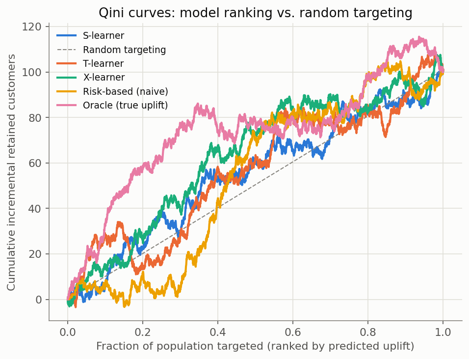
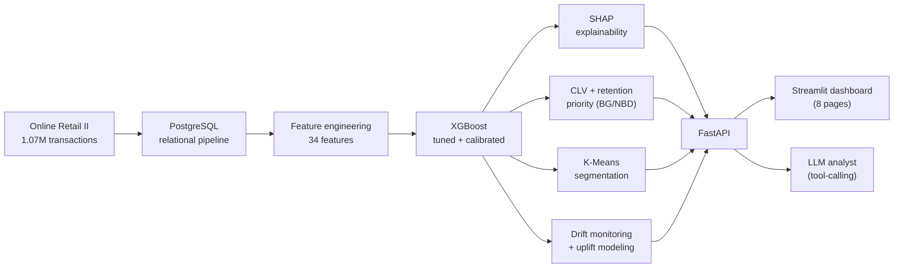

# Customer Intelligence & Churn Decision Platform


An end-to-end data science system that turns 1.07 million raw transaction
records from a real UK online retailer into a decision platform: **who is
going to churn, what they're worth, why the model thinks so, and who to
contact first** — served through a REST API, an 8-page analyst dashboard,
and a tool-calling LLM layer that can only answer from real, live-computed
numbers.

Every metric in this README was actually measured from the real data — none
is illustrative. The full step-by-step methodology, every design decision,
and every bug found along the way is in **[BUILD_LOG.md](BUILD_LOG.md)**.

---

## See it in action

<p>
  
  
</p>
<p>
  
  
</p>

Run it yourself in under a minute — see [Quick start](#quick-start) below.

---

## Key results

| Question | Answer | Backed by |
| --- | --- | --- |
| How big is the problem? | 4,323 customers, **42.5% churned** within 6 months | 1,067,371 real transactions, Dec 2009 – Dec 2011 |
| Can we predict it? | **0.81 ROC-AUC**, calibrated (Brier 0.175 vs. 0.180 raw) | Tuned, regularised XGBoost — overfitting gap closed from 0.232 to −0.008 |
| What does the model actually rely on? | `rfm_score` dominates (3× the runner-up) | SHAP, computed the same way in the API, the dashboard, and the LLM tool |
| Is "highest risk" the same as "worth saving"? | **No — 0% overlap** between the two rankings | Real, measured on the full population (not a toy example) |
| Would contacting someone actually help? | Depends who — some customers respond *negatively* | Simulated uplift modeling (S-/T-/X-learner), clearly labeled synthetic |
| Is the model still trustworthy over time? | Yes — prediction drift PSI 0.0094 (stable) | Checked against a real, independent 3-months-earlier snapshot |
| Is any of this tested? | **142 automated tests**, Ruff + Black clean | Real data cross-checks, hand-derived formulas, mocked LLM calls — no network needed |

---

## What makes this more than a churn-prediction notebook

- **Leakage prevention is proven, not claimed.** Every feature is checked against the pre-cutoff observation window with SQL assertions; a leaky version of `is_high_value` was built and shown to give a *different, wrong* answer, then compared against the real, correct one — the kind of check a skeptical interviewer would ask for.
- **The model is checked for the right kind of "good."** ROC-AUC and PR-AUC would let a model win by getting comfortably-retained customers even more comfortable; the search optimises PR-AUC and the report says why.
- **Causal thinking, not just correlation.** Step 20 asks a genuinely different question than the churn model does — "would contacting this customer change their behaviour" — and demonstrates the honest answer: this dataset has no real experiment, so the analysis is built on a clearly-labeled simulation, not passed off as a real finding.
- **An LLM layer that cannot make things up.** The "Ask the Analyst" chat interface is a tool-calling agent (Anthropic or OpenAI, provider-agnostic) whose system prompt requires a real tool call before any factual claim — every answer shows exactly which computation backed it.
- **Reviewed like production code.** The FastAPI service went through a multi-dimension review (security, correctness, API design) with independent verification of every finding; 9 real issues were found and fixed, none critical.

---

## Architecture



One implementation of each computation (model scoring, SHAP explanation,
drift analysis, uplift analysis) is shared by the API, the dashboard, and
the LLM tools — never reimplemented three times to quietly drift apart.

---

## Quick start

```bash
git clone <repository-url> && cd customer-intelligence-platform
make setup && source .venv/bin/activate

# Dashboard — works immediately, all models/data already computed
streamlit run dashboard/Home.py

# API (separate terminal)
uvicorn api.main:app --reload --port 8000
# docs at http://127.0.0.1:8000/docs

# Tests
pytest tests/ -v
```

```bash
curl -X POST http://127.0.0.1:8000/predict \
  -H "Content-Type: application/json" -d '{"customer_id": 12346}'
# {"customer_id":12346,"churn_probability":0.3736,"risk_level":"Medium",
#  "estimated_customer_value":32668.27,"retention_priority":12205.12,
#  "segment":"Champions (loyal, high value)"}
```

Optional — the LLM analyst layer (dashboard's "Ask the Analyst" page,
`POST /analyst/ask`) needs a real API key:
```bash
cp .env.example .env   # add ANTHROPIC_API_KEY=... or OPENAI_API_KEY=...
```

Rebuilding everything from the raw CSV (requires PostgreSQL, or use
`docker compose up --build` instead) and the full local dev setup are in
[BUILD_LOG.md](BUILD_LOG.md#installation).

---

## Project structure

```text
customer-intelligence-platform/
├── api/          FastAPI service — /predict, /predict/explain, /analyst/ask
├── dashboard/    Streamlit analyst dashboard (8 pages)
├── src/          Reusable library code — features, models, evaluation, monitoring, uplift, llm
├── scripts/      One runnable entry point per pipeline step
├── sql/          Schema, load, feature-extraction, and validation SQL
├── tests/        142 pytest tests
├── reports/      Every generated report and figure, real numbers only
├── config/       config.yaml — every project decision in one reviewable file
└── notebooks/    Narrative EDA
```

---

## Tech stack

| Layer | Tools |
| --- | --- |
| Data & modelling | Python 3.10, pandas, scikit-learn, XGBoost, Optuna |
| Storage | PostgreSQL, SQLAlchemy |
| CLV | `lifetimes` (BG/NBD + Gamma-Gamma) |
| Explainability | SHAP |
| Experiment tracking | MLflow |
| Serving | FastAPI, Uvicorn |
| LLM analyst | Anthropic / OpenAI SDKs, hand-rolled tool-calling (no framework) |
| Dashboard | Streamlit |
| Packaging | Docker, Docker Compose |
| Quality | pytest (142 tests), Ruff, Black |

---

## Full technical write-up

**[BUILD_LOG.md](BUILD_LOG.md)** documents all 21 steps in full: every
methodology choice and why, every real number, every bug found (and how it
was caught — usually by an independently recomputed check, not inspection),
and the exact command to reproduce every result in this README.

---

## Licence & attribution

Code: Apache License 2.0 (see [LICENSE](LICENSE)). Dataset: [UCI Online
Retail II](https://archive.ics.uci.edu/dataset/502/online+retail+ii),
Creative Commons Attribution 4.0.
