# Customer Intelligence & Churn Decision Platform

An end-to-end data science system that predicts customer churn, estimates customer
value, explains individual predictions, and ranks customers for retention action —
exposed through a REST API and an analyst dashboard.

> **Status:** in development. This README documents what is actually implemented.
> Sections are added as each component is completed. No metrics are reported until
> they have been produced from the real data.

---

## Build status

| Step | Component | Status |
| --- | --- | --- |
| 1 | Project architecture, config, logging | ✅ Complete |
| 2 | Dataset selection & profiling | ✅ Complete |
| 3 | PostgreSQL relational pipeline | ✅ Complete |
| 4 | Data quality & validation | ✅ Complete |
| 5 | Exploratory data analysis | ✅ Complete |
| 6 | Feature engineering | ✅ Complete |
| 7 | Baseline model (Logistic Regression) | ✅ Complete |
| 8 | Advanced model comparison (Random Forest, XGBoost) | ✅ Complete |
| 9 | Hyperparameter optimization (Optuna) | ✅ Complete |
| 10 | Probability calibration & business threshold | ✅ Complete |
| 11 | Explainable AI (SHAP) | ✅ Complete |
| 12 | Customer Lifetime Value & Retention Priority | ✅ Complete |
| 13 | Customer segmentation | ✅ Complete |
| 14 | FastAPI prediction service | ✅ Complete |
| 15 | Streamlit dashboard | ✅ Complete |
| 16 | MLflow experiment tracking | ✅ Complete |
| 17 | Docker | ✅ Complete |
| 18 | Testing & code quality | ✅ Complete |
| 19 | Model monitoring & drift detection | ✅ Complete |
| 20 | Uplift / causal modelling | ✅ Complete |
| 21 | LLM analyst layer | ✅ Complete |

---

## Business problem

For a non-subscription retailer, customers never formally cancel — they simply stop
buying. That makes churn *invisible* until revenue has already been lost. This project
turns silent lapse into a measurable, predictable, and actionable signal:

1. **Predict** which active customers will stop purchasing in the next six months.
2. **Value** each customer so that retention spend is not wasted on low-value accounts.
3. **Explain** each prediction so an analyst can act on it rather than trust a black box.
4. **Prioritise** a ranked call list combining risk and value.

---

## Dataset

**UCI Online Retail II** — real transaction records from a UK-based online gift retailer.

| Property | Value |
| --- | --- |
| Source | [UCI Machine Learning Repository, ID 502](https://archive.ics.uci.edu/dataset/502/online+retail+ii) |
| Licence | Creative Commons Attribution 4.0 (CC BY 4.0) — free for public portfolio use |
| Grain | One row per product line item on an invoice |
| Rows | 1,067,371 |
| Period | 2009-12-01 to 2011-12-09 |
| Identified customers | 5,942 |
| Invoices | 53,628 |
| Products (stock codes) | 5,305 |
| Countries | 43 |

The dataset has **no churn column**. Churn is a *derived* label: a customer active in
the year before a fixed cutoff date who makes no purchase in the following 183 days.
The cutoff and horizon live in [config/config.yaml](config/config.yaml) so the
definition is explicit and reproducible rather than buried in code.

### Getting the data

The raw CSV belongs at `data/raw/online_retail_II.csv` (gitignored — it is not
committed).

```bash
# Download from the UCI repository
curl -L -o data/external/online_retail_II.zip \
  https://archive.ics.uci.edu/static/public/502/online+retail+ii.zip
unzip -p data/external/online_retail_II.zip > data/raw/online_retail_II.xlsx
# then convert to CSV, or download the CSV export directly from Kaggle
```

---

## Data pipeline

```text
data/raw/online_retail_II.csv          1,067,371 denormalised line items
        │
        │  src/data/build_relational.py   — split into 5 normalised tables
        ▼
data/interim/*.csv                     countries, customers, products,
        │                              invoices, invoice_lines
        │  sql/schema.sql + sql/load_data.sql   — DDL, constraints, \copy, indexes
        ▼
PostgreSQL 16  ·  customer_intelligence
        │
        │  sql/build_features.sql       — labels + 22 features for one cutoff
        ▼
customer_features ⋈ churn_labels
        │
        │  sql/validation.sql           — 20 integrity & leakage assertions
        ▼
data/processed/customer_features_2011-06-09_h183.parquet
                                       4,323 customers × 25 columns
```

The export filename records the label definition, and the export query filters on
both `cutoff_date` and `horizon_days` — `churn_labels` is designed to hold several
definitions at once, so an unfiltered join would silently concatenate contradictory
targets for the same customer.

One command rebuilds the whole thing (**29.5 s** end to end on an M-series Mac):

```bash
python scripts/run_pipeline.py
```

### Entity-relationship diagram

```text
┌──────────────────┐
│    countries     │
├──────────────────┤
│ PK country_id    │──────────────┐
│    country_name  │              │
└──────────────────┘              │
         ▲                        │
         │ FK primary_country_id  │ FK country_id
         │                        │
┌──────────────────┐      ┌───────┴───────────────┐      ┌────────────────────┐
│    customers     │      │       invoices        │      │      products      │
├──────────────────┤      ├───────────────────────┤      ├────────────────────┤
│ PK customer_id   │◄─────│ PK invoice_no         │      │ PK stock_code      │
│ FK primary_      │  FK  │ FK customer_id  (NULL)│      │    description     │
│    country_id    │      │ FK country_id         │      │    item_type       │
└──────────────────┘      │    invoice_ts         │      └────────────────────┘
         ▲                │    invoice_type       │                 ▲
         │                └───────────────────────┘                 │
         │                          ▲                               │
         │                          │ FK invoice_no                 │ FK stock_code
         │                ┌─────────┴─────────────────────┐         │
         │                │        invoice_lines          │─────────┘
         │                ├───────────────────────────────┤
         │                │ PK line_id        (surrogate) │
         │                │    quantity, unit_price       │
         │                │    line_revenue   (GENERATED) │
         │                └───────────────────────────────┘
         │
         ├───────────────────────────────┬──────────────────────────────┐
         │ FK customer_id                │ FK customer_id               │
┌────────┴──────────────────┐   ┌────────┴─────────────────┐            │
│      churn_labels         │   │    customer_features     │            │
├───────────────────────────┤   ├──────────────────────────┤            │
│ PK (customer_id,          │   │ PK (customer_id,         │            │
│     cutoff_date,          │◄──┤     cutoff_date)         │            │
│     horizon_days)         │   │    22 feature columns    │            │
│    is_churned             │   └──────────────────────────┘            │
└───────────────────────────┘                                           │
                                                    derived tables ─────┘
```

**Key design decisions**, each verified against the raw data rather than assumed:

| Decision | Evidence |
| --- | --- |
| Country lives on `invoices`, not `customers` | 13 of 5,942 customers transact from more than one country |
| `invoice_lines` needs a surrogate PK | `(invoice_no, stock_code)` has 45,947 duplicate pairs |
| `products.description` is the *modal* description | 1,232 stock codes carry up to 9 different descriptions |
| `stock_code` is upper-cased before use as a PK | 173 codes differ from another only by case |
| `invoice_ts` = `MIN(InvoiceDate)` per invoice | 83 invoices span multiple timestamps (median spread 60 s) |
| Returns are `invoice_type = 'CREDIT'`, not a separate table | A `returns` table would duplicate identical columns |
| No `subscriptions` / `payments` / `support` tables | That data does not exist in this source and will not be invented |

### The churn label

The source has no churn column, so the target is derived and parameterised in
[config/config.yaml](config/config.yaml):

> A customer who bought merchandise in the **365 days before 2011-06-09** and made
> **zero purchases in the 183 days after it** is labelled churned.

| | |
| --- | --- |
| Eligible customers | **4,323** |
| Churned | **1,838 (42.52%)** |
| Retained | 2,485 (57.48%) |

The composite key on `churn_labels` lets several cutoff/horizon definitions coexist,
so the sensitivity of results to the label choice can be tested without overwriting
anything. The label is *highly* sensitive to the horizon, which is exactly why it is
a config parameter rather than a hard-coded constant:

| Cutoff | Horizon | Eligible | Churn rate |
| --- | --- | --- | --- |
| 2011-06-09 | 183 d | 4,323 | **42.52%** |
| 2011-03-09 | 91 d | 4,273 | 62.88% |

The 183-day definition is the project default: a 91-day window labels customers who
simply buy quarterly as churned, inflating the positive class to a degree that
reflects purchase cadence more than genuine attrition.

### Leakage control

Every feature CTE in `build_features.sql` filters `invoice_ts < cutoff + 1 day`. The
label CTE is the only code that reads post-cutoff rows, and it reads nothing but the
*existence* of a later sale. Four assertions in `sql/validation.sql` verify this holds:

```text
11 | PASS | LEAKAGE: no feature row has negative recency (purchase after cutoff)
12 | PASS | LEAKAGE: no feature row has recency > tenure
13 | PASS | LEAKAGE: every eligible customer purchased within the lookback window
14 | PASS | LEAKAGE: labels and features cover exactly the same customers
```

19 of 20 checks pass outright. Check 9 reports `KNOWN`: invoice `C496350` carries one
positive-quantity line on a credit note — a genuine source defect, documented with a
tolerance rather than silently patched.

### Engineered features (22)

Computed in SQL, strictly from the observation window:

| Group | Features |
| --- | --- |
| RFM core | `recency_days`, `frequency`, `monetary_total`, `monetary_avg_order` |
| Tenure & cadence | `tenure_days`, `active_days`, `avg_interpurchase_days`, `std_interpurchase_days`, `purchase_rate_per_month` |
| Basket | `total_items`, `avg_items_per_order`, `distinct_products`, `avg_unit_price` |
| Returns | `return_invoices`, `return_value`, `return_rate` |
| Recent activity | `orders_last_30d`, `orders_last_90d`, `spend_last_90d`, `spend_ratio_90d` |
| Context | `country_name`, `is_uk` |

Monetary features count **merchandise only** — postage, bank charges, discounts,
samples, vouchers and adjustments are classified via `products.item_type` and
excluded, without deleting the rows from the database.

### Database setup

```bash
# macOS
brew install postgresql@16
brew services start postgresql@16
export PATH="/opt/homebrew/opt/postgresql@16/bin:$PATH"

# Create the role and database
psql -d postgres -c "CREATE ROLE ci_user WITH LOGIN PASSWORD '<your-password>';"
psql -d postgres -c "CREATE DATABASE customer_intelligence OWNER ci_user;"

# Record the credentials (this file is gitignored)
cp .env.example .env && $EDITOR .env

python scripts/run_pipeline.py
```

Credentials reach `psql` through libpq environment variables via
`src.config.get_psql_env()`, so the password never appears in a process argument
list or in an error message.

Useful flags:

```bash
python scripts/run_pipeline.py --skip-build          # reuse data/interim CSVs
python scripts/run_pipeline.py --skip-load           # features only, no reload
python scripts/run_pipeline.py --cutoff 2011-03-09 --horizon 91   # alternate label
```

### Verifying the pipeline

```bash
psql -d customer_intelligence -c "
  SELECT cutoff_date, count(*) AS customers,
         round(100.0*avg(is_churned::int), 2) AS churn_rate_pct
  FROM churn_labels GROUP BY 1;"
```

---

## Data quality and validation

`sql/validation.sql` (Step 3) checks *pipeline integrity* — referential integrity,
row-count reconciliation, and leakage. **Step 4 is a separate, statistical pass**:
distributions, outliers, class balance, and feature-target correlation, run on both
the raw CSV and the model-ready feature table.

```bash
python scripts/run_data_quality.py
```

This writes [reports/data_quality_report.md](reports/data_quality_report.md) — every
number in it is measured from the real data, not asserted. The checks themselves live
in [src/data/quality.py](src/data/quality.py) as small, reusable functions (missing-value
report, duplicate report, IQR outlier report, target-correlation leakage screen, etc.)
rather than one-off notebook code, so they can be reused in Step 5's EDA and asserted
on directly in Step 18's test suite.

**Nothing is dropped without justification.** Two examples of findings that were
investigated rather than assumed:

- **34,335 exact duplicate raw line items.** Inspection showed these are the same
  product logged as separate identical lines on one invoice (e.g. invoice `489517`,
  stock code `21912` appears 3 times identically) — a till/EPOS pattern, not a
  data-entry error. **Kept** — deduplicating would understate revenue.
- **`return_rate` > 1.0 for 9 customers** (returns exceed in-window purchases, up to
  4.27×) — genuine (returning stock bought before the lookback window began), not a
  bug. **Capped at 1.0** for modelling stability; the original value is preserved in
  `return_rate_raw` rather than discarded.

Cleaning is a separate, explicit step from detection (`clean_customer_features` in
`src/data/quality.py`) and never touches the original file:

```text
data/processed/customer_features_2011-06-09_h183.parquet             (untouched, 25 cols)
data/processed/customer_features_2011-06-09_h183_validated.parquet   (+3 cols: flags + raw return rate)
```

| Finding | Severity | Treatment |
| --- | --- | --- |
| 34,335 duplicate raw line items | Low | Keep — legitimate repeated EPOS entries |
| 22.77% of raw rows have no Customer ID | Expected | Keep in DB; excluded from features by design |
| Ambiguous country labels (`Unspecified`, `RSA`, ...) | Low | Keep; `is_uk` is the split that matters |
| Right-skewed monetary/frequency features (resellers) | Medium | Keep; log-transform for linear models (Step 7) |
| `return_rate` > 1 for 9 customers | Low | Capped at 1.0; raw value kept in `return_rate_raw` |
| Null interpurchase-gap for low-frequency customers | Expected | Kept null + `*_is_missing` flag added |
| `recency_days` correlates 0.39 with the target | Watch | Not leakage (pre-cutoff only); flagged for SHAP (Step 11) |
| Mild class imbalance (42.5% / 57.5%) | Low | `class_weight='balanced'`; no resampling needed |

---

## Exploratory data analysis

[notebooks/01_eda.ipynb](notebooks/01_eda.ipynb) — the narrative EDA. All plotting
and statistical-test logic lives in [src/eda.py](src/eda.py) (colorblind-safe,
palette-validated chart functions plus Mann-Whitney and chi-square helpers), so the
notebook only calls into it and tells the analytical story; the dashboard (Step 15)
will reuse the same functions rather than duplicating chart code.

```bash
jupyter nbconvert --to notebook --execute --inplace notebooks/01_eda.ipynb
```

**Key findings** (full detail and evidence in the notebook):

- Every one of 10 numeric features tested differs significantly between churned and
  retained customers (Mann-Whitney, p < 0.001 after Bonferroni correction).
- **Recency dominates**: median 59 days (retained) vs. 196 days (churned); churn
  climbs from 16% to 69% across recency quintiles. Verified as legitimate, not
  leakage — pre-cutoff only, per the four SQL assertions in Step 3.
- **Monetary value and churn move in clean, opposite gradients**: 69.1% churn in
  the lowest-spend quintile vs. 11.9% in the highest — exactly why Step 12 combines
  value and risk instead of ranking on churn probability alone.
- **Recent (90-day) activity separates customers more sharply than lifetime totals**:
  58.3% churn with no order in the last 90 days pre-cutoff vs. 23.7% with at least one.
- **Product-catalogue breadth is protective**: 63.6% churn (bottom quintile of
  distinct products bought) down to 15.6% (top quintile).
- **Tenure's relationship with churn is non-monotonic** — highest in the
  second-shortest tenure bin, not the shortest — consistent with new customers not
  yet having had a fair chance to re-order inside the observation window.
- Geography is a weak signal: `is_uk` alone is not significant (p=0.44); the full
  country breakdown is (p=0.007), but 91.5% of customers are UK-based and most
  non-UK countries have samples too small (<25 customers) to act on.
- `frequency` and `active_days` carry near-duplicate information (r=0.961) —
  relevant for the linear baseline (Step 7), less so for tree-based models (Step 8).

All figures are saved to [reports/figures/](reports/figures/):

<p>
  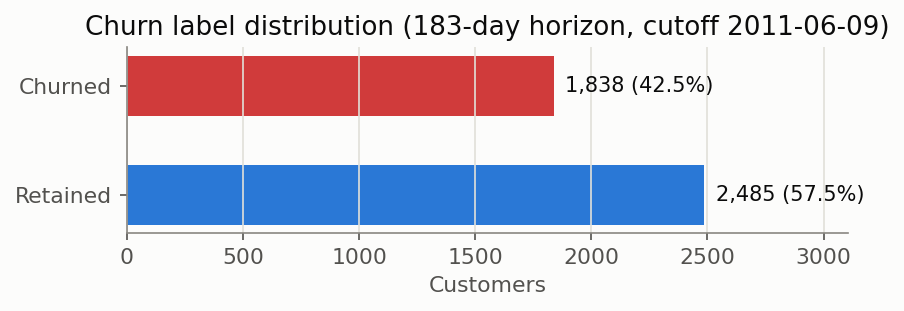
  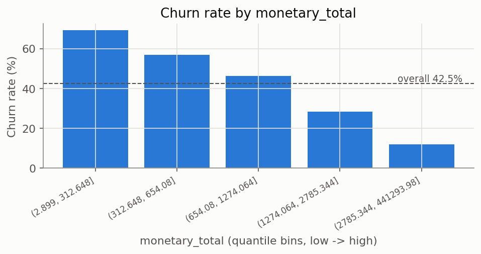
</p>

---

## Feature engineering

```bash
python scripts/run_feature_engineering.py
```

Reads the Step 4 validated feature table (4,323 customers) and produces
`data/processed/train.parquet` (3,458), `data/processed/test.parquet` (865), the
fitted transformer `models/feature_engineer.joblib`, and
[reports/feature_engineering_report.md](reports/feature_engineering_report.md) — a
full dictionary of every feature reaching the model (formula, business meaning,
churn hypothesis, leakage risk), generated from
[src/features/catalog.py](src/features/catalog.py).

**Split strategy: stratified random, not time-based.** The feature table is a
single cross-sectional snapshot — one row per customer at one fixed cutoff — so
there is no per-row time axis to split on; a genuine time-based split would need
multiple snapshot cutoffs, a larger exercise reserved for future drift work
(Step 19). The split is stratified on `is_churned` (train 42.51% churned, test
42.54% — both within 0.1pp of the full dataset's 42.52%).

**New features** (on top of the 22 SQL features from Step 3 and the 2 quality
flags from Step 4), built by [`src/features/engineer.py`](src/features/engineer.py)'s
`CustomerFeatureEngineer`:

| Feature | Formula | Why |
| --- | --- | --- |
| `spend_per_tenure_month` | `monetary_total / (tenure_days / 30.44)` | Spend velocity, not just accumulated total |
| `orders_ratio_90d` | `orders_last_90d / frequency` | Scale-free trend signal (complements `spend_ratio_90d`) |
| `products_per_order` | `distinct_products / frequency` | Catalogue breadth per transaction |
| `purchase_regularity_cv` | `std_interpurchase_days / avg_interpurchase_days` | How predictable a customer's rhythm is — the closest honest substitute this dataset has for a "contract risk" signal (no contract data exists) |
| `rfm_score` | R/F/M quantile-scored 1–5, summed (3–15) | Classic composite score for reporting/segmentation |
| `is_high_value` | `monetary_total >= 75th pct(train)` | Business-readable top-quartile flag |

**Leakage discipline, proven not just claimed.** `rfm_score` and `is_high_value`
need a quantile threshold learned from data — exactly the kind of feature that
leaks if mishandled. `CustomerFeatureEngineer.fit()` is called on the training
split only; the test split reuses those thresholds rather than recomputing its
own. Verified concretely: the test split's own 75th percentile of
`monetary_total` is 2,487.30 (different from the 2,189.00 learned on train) — if
`is_high_value` had been (incorrectly) computed from the test split itself,
25.1% of test customers would be flagged by construction. The actual flagged
share is **28.3%**, proving the training threshold was applied, not a refit one.

`rfm_score` alone produces a clean, monotonic churn gradient on the training
split — 79.6% churn at the lowest score (3) down to 2.8% at the highest (14) —
without needing any model at all.

---

## Baseline model — Logistic Regression

```bash
python scripts/run_baseline_model.py
```

The first model, and deliberately **not tuned** — it's the benchmark every later
model (Step 8's comparison, Step 9's tuned candidate) must beat to justify its
added complexity. `sklearn.Pipeline` + `ColumnTransformer`: median imputation +
Yeo-Johnson power transform + standardisation for numeric features, passthrough
for booleans, `LogisticRegression(class_weight='balanced')`. All fit on the
training split only.

| Metric | Train | Test |
| --- | --- | --- |
| Accuracy | 0.7131 | 0.7214 |
| Precision | 0.6334 | 0.6494 |
| Recall | 0.7721 | 0.7500 |
| F1 | 0.6959 | 0.6961 |
| ROC-AUC | 0.7904 | **0.8018** |
| PR-AUC | 0.7118 | **0.6966** |

Train and test scores are close — no meaningful overfitting. **Accuracy alone
would be misleading here**: a trivial "always predict retained" model scores
57.5% accuracy while catching zero churners, which is worthless for a retention
program. ROC-AUC and especially PR-AUC (test base rate 42.5%) are reported for
exactly that reason.

**A real finding, reported rather than hidden**: for 13 of the 27 features, the
fitted coefficient's sign disagrees with that feature's own univariate
correlation with churn — including `rfm_score`, which has the single strongest
univariate correlation of any feature (-0.474) yet nearly vanishes in the
multivariate fit. The design matrix's condition number is 145.9 (>30 signals
real multicollinearity). This doesn't hurt the model's predictions or ranking —
only the interpretability of individual coefficients — and is diagnosed in full,
feature-by-feature, in
[reports/baseline_model_report.md](reports/baseline_model_report.md). Step 9's
regularisation search and Step 8's tree-based models (not sensitive to
collinearity) are the paths to a model whose coefficients/importances can be
read at face value.

Excluded from this linear model specifically (each for a measured reason —
Step 8's trees may reuse them): `country_name`, `active_days`, the three RFM
sub-scores, `return_rate_raw`, `orders_ratio_90d`.

<p>
  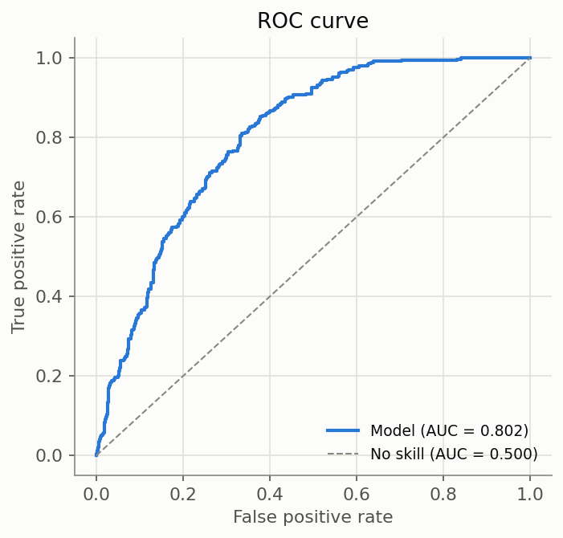
  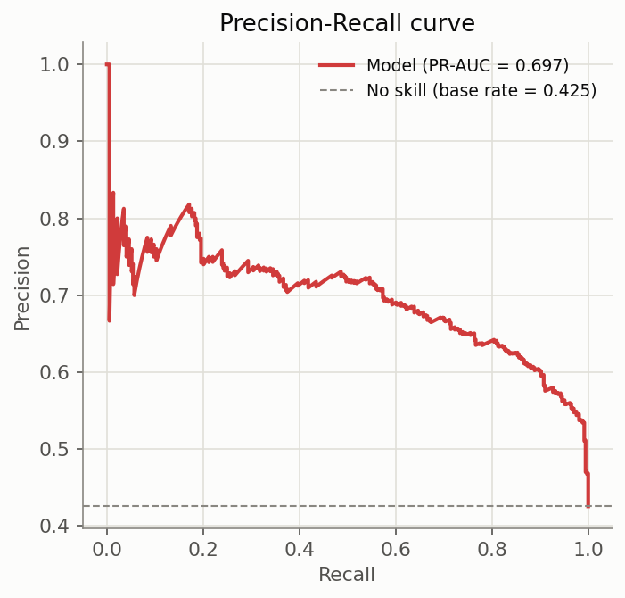
  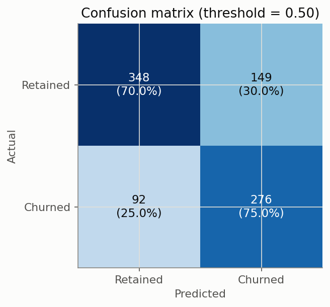
</p>

---

## Model comparison — Random Forest and XGBoost vs. the baseline

```bash
python scripts/run_model_comparison.py
```

| Model | Test ROC-AUC | Test PR-AUC | Overfit gap (train − test AUC) | Train time |
| --- | --- | --- | --- | --- |
| **Logistic Regression** | **0.8018** | **0.6966** | -0.011 | (Step 7) |
| Random Forest | 0.7993 | 0.6954 | 0.201 | 0.41s |
| XGBoost | 0.7679 | 0.6780 | 0.232 | 0.50s |

**The untuned Logistic Regression baseline wins.** Real result, not a bug: with
only 3,458 training rows, both untuned tree ensembles show substantial
overfitting (see the overfit-gap column) that the much lower-capacity linear
model doesn't. XGBoost's top-5 feature importances even include
`country_Denmark` — a country with only 6 training customers, 0% of them
churned, i.e. the model memorized a subgroup this small rather than learning a
real geographic effect. This is the concrete evidence behind "the most complex
model is not automatically the best," and it's exactly the scenario Step 9's
hyperparameter search (constraining depth, adding regularization) targets —
not evidence trees are the wrong model family here.

Both tree models use the **full 34-column feature set**, including everything
Step 7 excluded for the linear model on collinearity grounds — trees aren't
sensitive to that problem. Random Forest's importances spread fairly evenly
across ~15 features; XGBoost's concentrate heavily on `rfm_score` alone
(importance 0.27, more than double the next feature) — a first hint of the two
algorithms' very different sensitivity to correlated inputs, worth revisiting
with SHAP in Step 11.

A second boosting library (LightGBM/CatBoost) was deliberately not added:
Random Forest and XGBoost already span bagging vs. boosting, and a second
booster would mostly repeat XGBoost's story on a dataset this size rather than
add a genuinely different comparison point.

<p>
  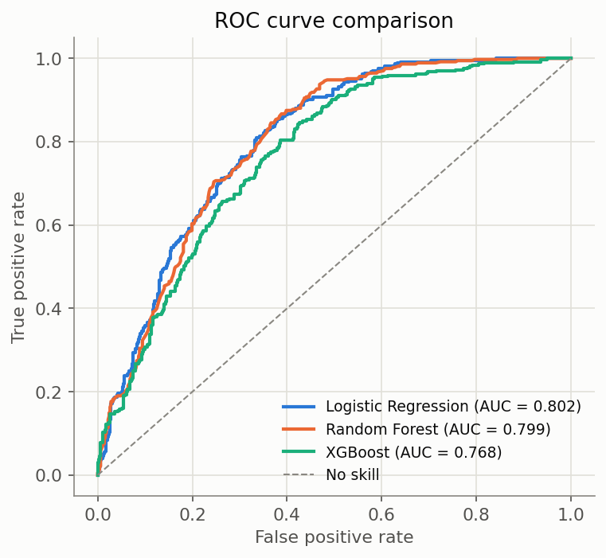
  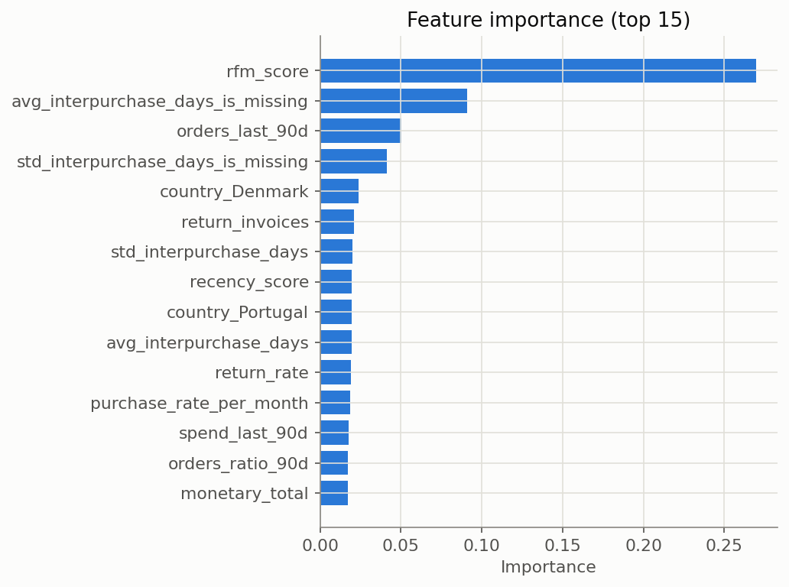
</p>

Full discussion — interpretability trade-offs, business cost of each model
choice, and reasoning for the Step 9 tuning candidate — in
[reports/model_comparison_report.md](reports/model_comparison_report.md).

---

## Hyperparameter optimization — XGBoost

```bash
python scripts/run_hyperparameter_tuning.py
```

**Candidate: XGBoost**, chosen because Step 8 diagnosed it (not Random Forest)
as showing the largest overfitting gap (0.232) with the richest set of
regularization controls to fix it directly. Search: **Optuna** (TPE sampler),
50 trials, stratified 5-fold CV on the training split only — preferred over
RandomizedSearchCV because the 9-parameter, mostly-continuous space is exactly
where a sequential, model-guided sampler out-samples uniform random draws.
Optimized for **PR-AUC (average precision)**, not ROC-AUC: under this mild
imbalance, ROC-AUC can improve entirely via the tail nobody acts on, while
PR-AUC tracks the positive-class ranking that actually drives Step 12's
retention-priority list.

| Model | Test ROC-AUC | Test PR-AUC | Overfit gap |
| --- | --- | --- | --- |
| XGBoost (untuned, Step 8) | 0.7679 | 0.6780 | 0.232 |
| **XGBoost (tuned)** | **0.8091** | **0.6998** | **-0.008** |
| Logistic Regression (Step 7/8) | 0.8018 | 0.6966 | -0.011 |

**Tuning genuinely fixed the overfitting** (gap closed by 0.24, essentially to
zero) **and the tuned model now beats the linear baseline** by +0.0073
ROC-AUC — achieved through regularization (`max_depth=3`, strong L1/L2,
`gamma=3.95`), not raw capacity. The search converged by trial 4 of 50 and
never meaningfully improved after — the trial budget was more than sufficient.
The test set was touched exactly once, after the search completed, never
during the 50-trial CV loop.

<p>
  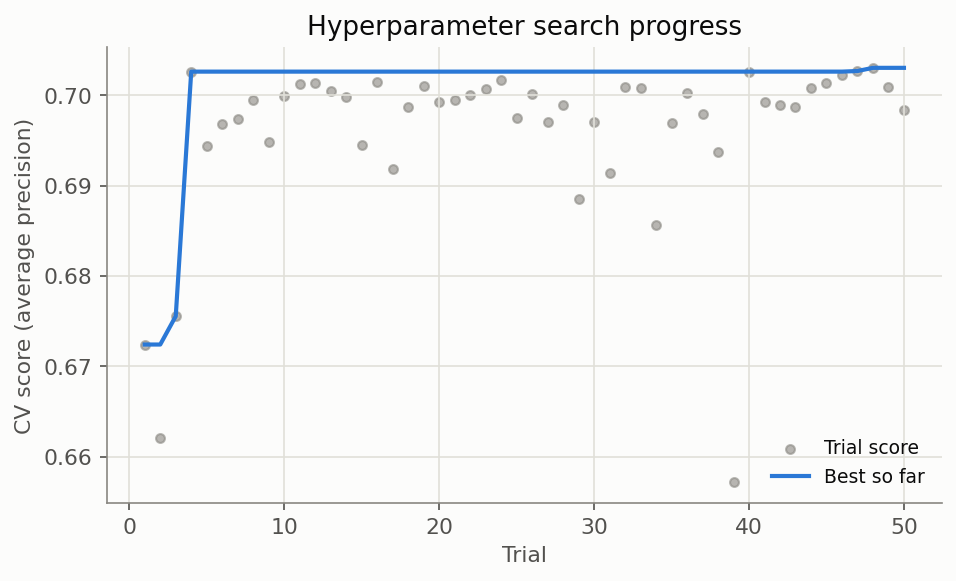
  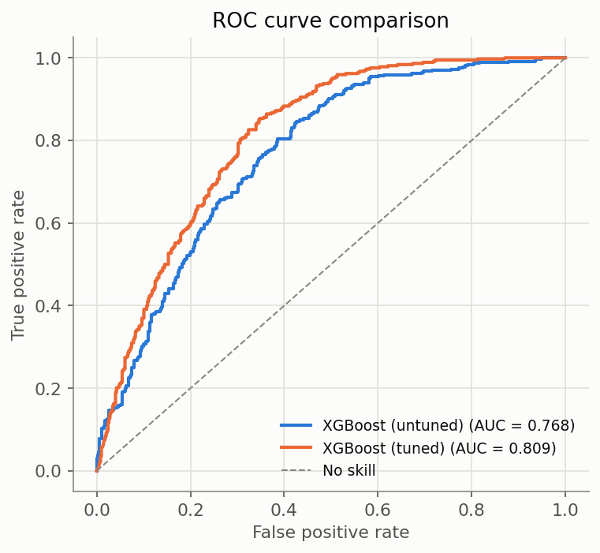
</p>

Full search space, top trials, and best parameters in
[reports/hyperparameter_tuning_report.md](reports/hyperparameter_tuning_report.md);
all 50 trial results in `reports/optuna_trials.csv`.

---

## Probability calibration and business threshold

```bash
python scripts/run_calibration_and_threshold.py
```

Uses the Step 9 tuned XGBoost model — but checks something ROC-AUC/PR-AUC
never test: **are its predicted probabilities trustworthy as probabilities?**
`scale_pos_weight` (used to correct class imbalance) is known to distort this
even when it helps ranking metrics.

| Probabilities | Brier score |
| --- | --- |
| Raw (tuned XGBoost) | 0.1804 |
| Calibrated (sigmoid) | 0.1755 |
| **Calibrated (isotonic)** | **0.1746** |

Isotonic calibration measurably improves the Brier score, fit via 5-fold CV on
the training split only (test never touched during fitting) — **adopted**,
saved as `models/final_churn_model.joblib`. The reliability diagram confirms
why: the raw model is visibly underconfident in the mid-probability range.

**Business-cost framework** (a demonstration, explicitly labeled): Online
Retail II has no record of any real retention campaign, so `contact_cost` and
`retention_success_rate` are stated, hypothetical assumptions — only
`value_per_customer` (€899.54, median training `monetary_total`) is measured.

| Scenario | Contact cost | Success rate | Optimal threshold |
| --- | --- | --- | --- |
| Cheap, low-touch | €2 | 12% | 0.08 |
| Primary (moderate offer) | €15 | 25% | 0.08 |
| Expensive, high-touch | €120 | 20% | **0.36** |

The threshold genuinely moves with the assumptions — not a token gesture: an
expensive, uncertain-payoff intervention pushes the model to be far more
selective. **Caveat reported alongside the recommendation, not hidden**: the
primary scenario's "optimal" threshold (0.08) flags 84% of test customers —
mathematically correct given the stated costs, but closer to a mass campaign
than a targeted list; a real team's capacity constraint isn't part of this
simple framework, and a fixed contact-list size is often the more usable
operational answer.

<p>
  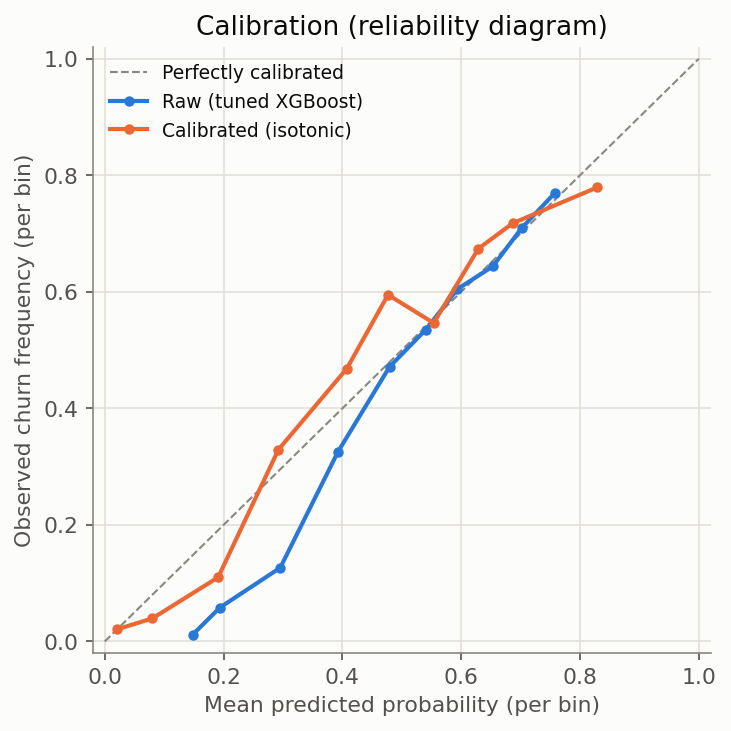
  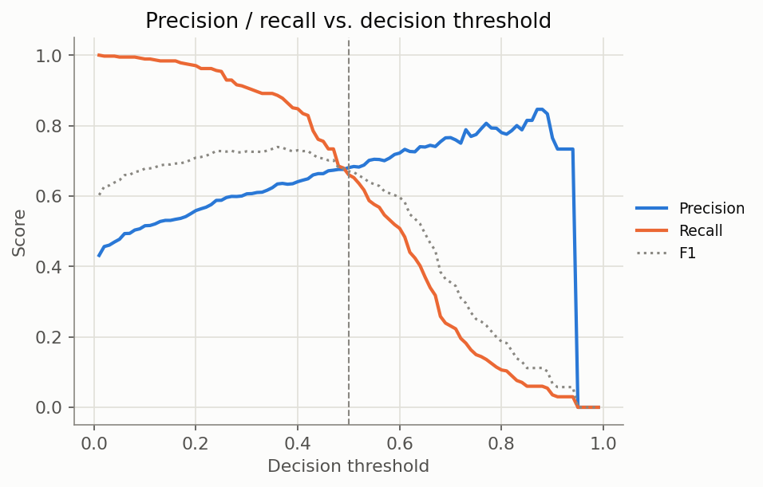
</p>

Full detail — threshold-performance table, cost-framework mechanics, and the
uplift-modeling caveat this framework doesn't capture (Step 20's territory) —
in [reports/calibration_threshold_report.md](reports/calibration_threshold_report.md).

---

## Explainable AI — SHAP

```bash
python scripts/run_shap_explainability.py
```

**Which model SHAP explains, and why**: the final model (Step 10) is a
`CalibratedClassifierCV` — internally 5 cloned pipelines, one per calibration
fold — which SHAP's `TreeExplainer` cannot open directly. SHAP attribution is
computed on the pre-calibration Step 9 tuned XGBoost pipeline (calibration
rescales the output; it doesn't change what the trees split on); the
probability shown for every customer still comes from the calibrated final
model, matching what Step 14's API will return.

**Global**: `rfm_score` dominates (mean |SHAP| 0.31, ~3x the runner-up
`recency_days` at 0.11), with an almost perfectly monotonic dependence plot.
This directly **contrasts with Step 7's Logistic Regression**, where
`rfm_score` had the strongest univariate correlation of any feature yet its
coefficient nearly vanished — absorbed by its own raw ingredients still in the
linear model. Trees don't have that problem: a concrete, measured illustration
of why Step 8 compared multiple model families instead of trusting one's
feature ranking.

**Local**: a reusable `explain_customer(customer_id, ...)` function (used
identically here and by the future Step 14 `/predict/explain` endpoint) —
narrative + a red/blue waterfall-style chart using the same churn-color
convention as every chart since Step 5:

> Customer 14822: 94.9% predicted churn probability (High risk). Top factors
> increasing risk: rfm_score = 3 (+0.35); recency_days = 302 (+0.19);
> monetary_total = 158 (+0.14)...

**What SHAP does and doesn't mean, stated explicitly**: values are in log-odds
space (not literal probability points), and — critically — **a high-impact
feature is not a cause of churn**. `recency_days` dominates partly because
it's mechanically close to how churn is *labelled*; that's expected, not
evidence of causation. Real causal claims need Step 20's experimental design,
not an explainability method applied to an observational model.

<p>
  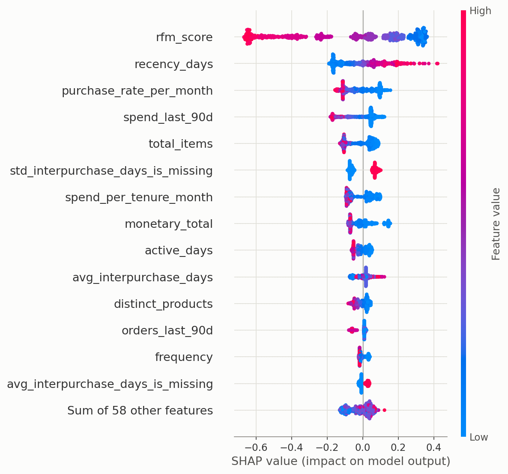
  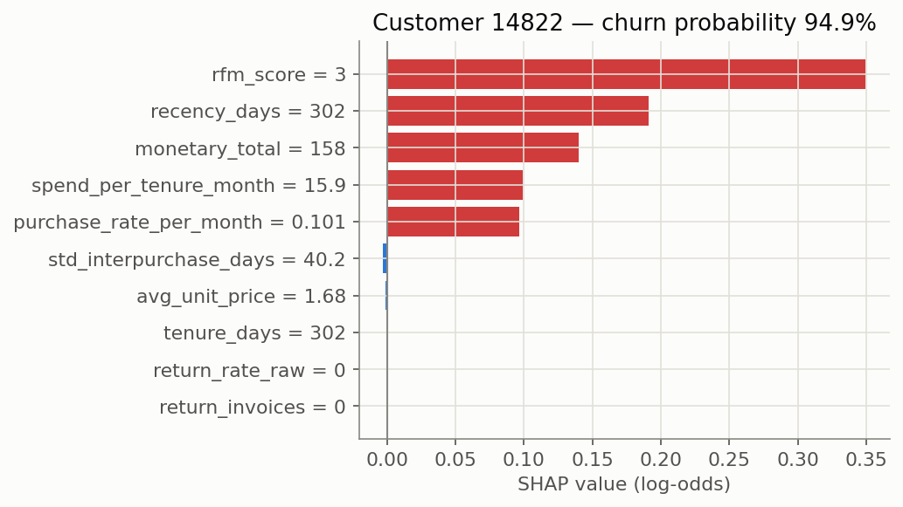
</p>

Full detail in [reports/shap_explainability_report.md](reports/shap_explainability_report.md).

> **Dependency note**: SHAP 0.49.1 (latest) cannot parse XGBoost ≥3.0's
> `base_score` serialization format ([shap#4202](https://github.com/shap/shap/issues/4202)).
> `xgboost` is pinned to `2.1.4` in requirements.txt; Steps 8-10 were
> regenerated under this version and produced byte-identical results.

---

## Customer Lifetime Value and Retention Priority

```bash
python scripts/run_clv_and_retention_priority.py
```

**Methodology: BG/NBD + Gamma-Gamma**, not a simpler average-spend proxy —
justified because Online Retail II genuinely has what this needs: a full
multi-year repeat-purchase transaction history per customer in a
non-contractual setting, the textbook use case these models were built for.
CLV is projected over the same 183-day horizon as the churn label, using each
customer's complete transaction history (not the churn model's 365-day
lookback window).

Checked, not assumed: Gamma-Gamma's independence assumption (correlation
between frequency and monetary value = 0.084, negligible — holds). **Found by
testing, not theory**: Gamma-Gamma's conditional-expectation formula is
unstable at `frequency=0` — verified it returns a *negative* "expected
profit" for one-time buyers — confirming why they're handled with their own
observed transaction value instead (32.5% of the population, so this isn't a
minor edge case).

**Retention Priority Score** = `churn_probability × CLV` — the expected
revenue at risk if nothing is done, deliberately the simplest defensible
formula rather than an arbitrarily "improved" one.

**Why churn probability alone is not enough — measured**: ranking the same
200-customer contact budget by churn probability alone vs. the combined
score:

| Ranking strategy | Total CLV-at-risk captured |
| --- | --- |
| Churn probability alone | €7,172 |
| **Retention priority score** | **€118,980** |

The two lists share **zero customers**. The highest churn-probability
customers are long-dormant, zero-repeat-purchase accounts worth €50-60 each —
the model is confident they're already gone, and there's little left to
protect. The top priority-ranked customer has only 37% churn probability but
an estimated €32,668 CLV.

**A limitation surfaced, not hidden**: the pure product formula lets extreme
CLV outliers dominate the ranking even at low risk (8 of the top 10 are "Low
risk / High value," not "High risk / High value") — mathematically correct,
but a customer at 1.6% churn probability is already essentially certain to
stay, so ranking them highly overstates how actionable they are. A real
deployment would filter to a minimum meaningful risk threshold first (e.g.
Step 10's cost-optimal threshold) before ranking by priority score.

<p>
  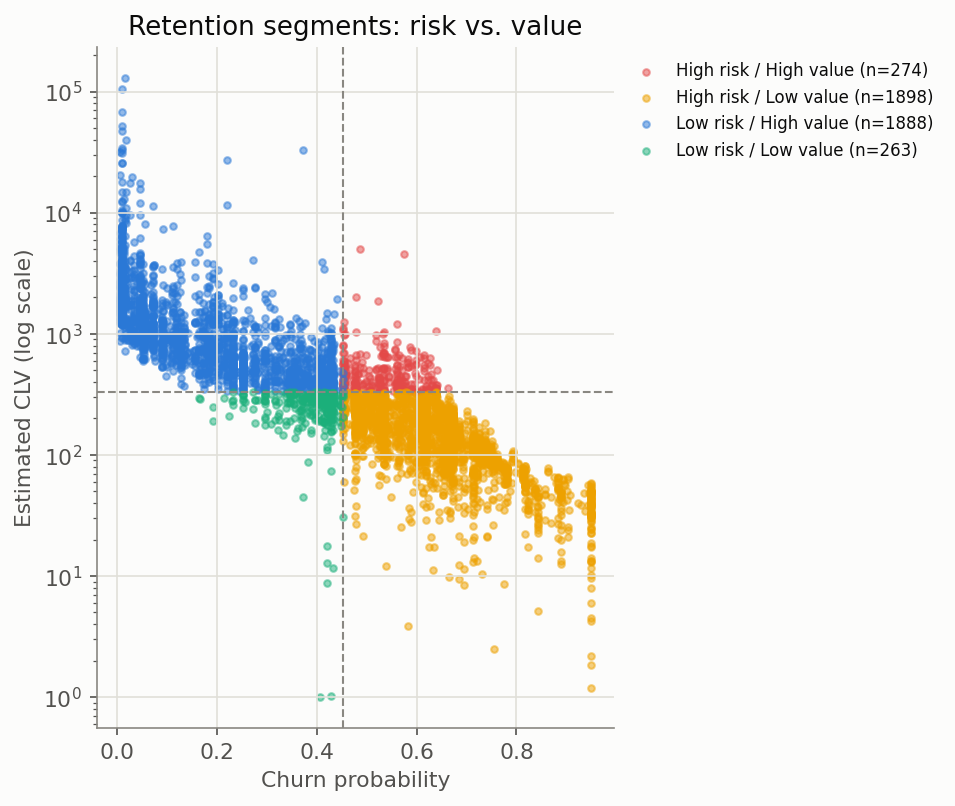
  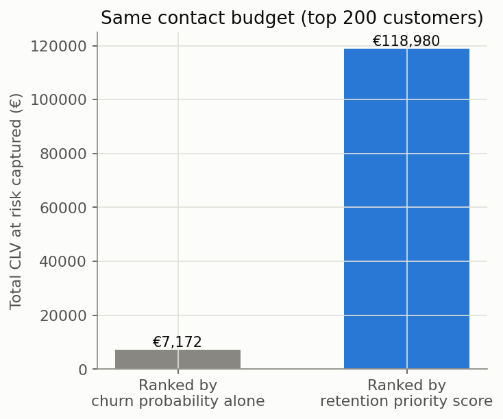
</p>

Full detail, fitted model parameters, and the ranked list for all 4,323
customers in
[reports/clv_retention_priority_report.md](reports/clv_retention_priority_report.md)
and `reports/retention_priority_list.csv`.

---

## Customer segmentation

```bash
python scripts/run_customer_segmentation.py
```

K-Means on RFM + tenure + catalogue breadth + 90-day engagement + Step 12's
CLV estimate (Yeo-Johnson power-transformed and standardised — Euclidean
distance is scale-sensitive the same way Step 7's linear model was).
`rfm_score` is deliberately excluded to avoid double-counting the same signal
its own inputs already provide.

**K chosen by evidence, not convenience**: silhouette peaks at K=3 (0.363),
but K=4 (0.330) is used instead — a stated trade-off. At K=3 the customers
who've gone quiet form one cluster; at K=4 that splits into a **moderate-value,
still-reachable** group and a **near-total-loss, one-time-buyer** group with a
23-point churn-rate gap between them. Validated two ways: split-half stability
ARI=0.957 (highly reproducible across resamples) and K-Means vs. Hierarchical
agreement ARI=0.729 (not a K-Means-specific artifact).

| Segment | Churn rate | Median CLV | Profile |
| --- | --- | --- | --- |
| **Champions** | 11.4% | €1,139 | Lowest recency, highest frequency/value/tenure/breadth |
| Declining / Moderate value | 47.5% | €310 | Recency climbing, still reachable |
| New / Developing | 41.7% | €322 | Short tenure, most history is recent by definition |
| **Lost / One-time buyers** | 70.5% | €105 | Frequency ≈1, longest recency, hardest to influence |

**Does segmentation add value beyond the supervised model?** Cross-tabulated
against Step 12's risk/value quadrant: **ARI = 0.32** (low-to-moderate) — the
clusters are *not* simply re-deriving that simpler 2×2 split. "Declining" and
"New" customers, in particular, spread across three of the four quadrants
each, showing segmentation surfaces tenure/engagement structure the risk ×
value view alone collapses away.

<p>
  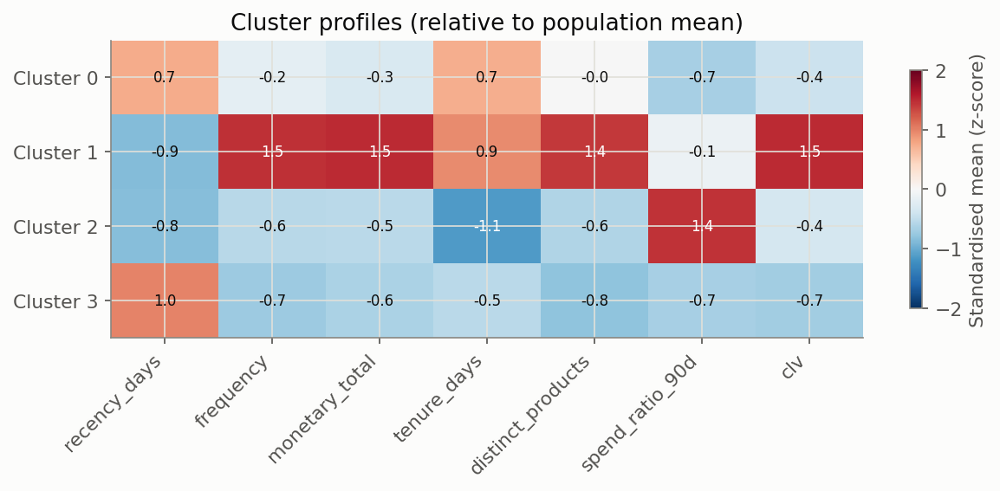
  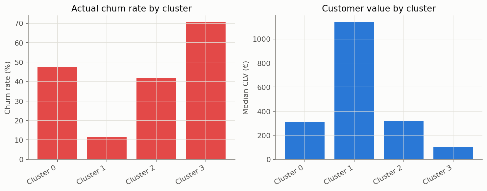
</p>

Full detail in [reports/segmentation_report.md](reports/segmentation_report.md);
segmented list for all 4,323 customers in `reports/customer_segments.csv`.

---

## FastAPI prediction service

> **`uvicorn` and `pytest` are two independent commands, not sequential
> steps — never run them back-to-back in the same terminal.** `uvicorn
> --reload` starts a persistent server that runs forever until you press
> `Ctrl+C`; it never exits on its own. If you run `pytest` right after it in
> the same shell, the shell is still blocked running `uvicorn` and `pytest`
> never starts — it just looks stuck. `pytest tests/test_api.py` doesn't need
> the server running at all (it loads the app in-process via `TestClient`) —
> run it on its own, in a terminal where nothing else is running. Only start
> `uvicorn` if you want to manually poke at the API yourself (browser, curl,
> Swagger docs).

```bash
uvicorn api.main:app --reload --port 8000
```

Swagger UI: http://127.0.0.1:8000/docs · ReDoc: http://127.0.0.1:8000/redoc

Endpoints:

| Endpoint | Method | Returns |
| --- | --- | --- |
| `/health` | GET | Service status, whether models are loaded, customer count |
| `/predict` | POST | `churn_probability`, `risk_level`, `estimated_customer_value` (Step 12 CLV), `retention_priority` (Step 12 score), `segment` (Step 13) |
| `/predict/explain` | POST | Everything `/predict` returns, plus the top SHAP risk/protective factors and a plain-English narrative |
| `/analyst/ask` | POST | Step 21's LLM analyst: a natural-language `question` in, a tool-grounded `answer` plus the full `tool_calls` trace out. 503 if no API key is configured. |

```bash
curl -X POST http://127.0.0.1:8000/predict \
  -H "Content-Type: application/json" -d '{"customer_id": 12346}'
```

```json
{
  "customer_id": 12346,
  "churn_probability": 0.3736,
  "risk_level": "Medium",
  "estimated_customer_value": 32668.27,
  "retention_priority": 12205.12,
  "segment": "Champions (loyal, high value)"
}
```

**Scope, stated explicitly**: the API scores the 4,323 customers already in
the project's historical feature table (looked up by `customer_id`) — it does
not accept arbitrary new-customer feature payloads. A live system serving
genuinely new customers would need a real-time feature-computation pipeline
(the SQL in `sql/build_features.sql` generalizes to that); building one is a
separate, larger engineering task outside this project's scope. This is
documented in `api/state.py` rather than left as a silent limitation.

**Models loaded once, at startup** (`api/state.py`, via FastAPI's lifespan
hook) — no request re-loads or re-fits anything, including the SHAP
`TreeExplainer` itself (cached once at startup, not rebuilt per
`/predict/explain` call). SHAP attribution reuses the pre-calibration tuned
XGBoost pipeline (Step 9); the displayed probability comes from the
calibrated final model (Step 10) — the same split Step 11 already
established, not reimplemented here. `/predict/explain` calls the exact same
`explain_customer()` function from `src/explainability.py` used in Step 11's
batch report — one implementation, not two.

**Reviewed and hardened**: a multi-dimension review (security, correctness,
API design, error handling) with independent adversarial verification of
every finding surfaced 9 confirmed real issues, none critical — all fixed:
the two data-merges in `api/state.py` now use `validate="one_to_one"` so a
future duplicate `customer_id` fails loudly at startup instead of silently
scoring the wrong row; a present-but-corrupted model file now raises a
specific, actionable error instead of a raw exception; `/predict` and
`/predict/explain` now document their 404/500 responses in the OpenAPI spec;
`ExplainResponse`'s documented example now shows its own fields instead of
inheriting `PredictResponse`'s; the risk-band cutoffs (0.30/0.60) are now a
single constant in `src/explainability.py` imported by the API rather than
restated as separate literals; and the no-auth/no-rate-limit design is now an
explicit, stated scope decision (portfolio demo, public dataset, no real PII)
in `api/main.py`'s docstring rather than a silent gap.

**Testing**:

```bash
pytest tests/test_api.py -v
```

12 tests, including one that asserts the live API's prediction for a known
customer matches (within 1e-3) the value already computed offline by Step
12's batch pipeline — the API is checked against the project's own prior
results, not just for "a plausible-looking response." `/analyst/ask` has its
own 7 tests in `tests/test_api_analyst.py` (Step 21), with the LLM call
mocked so the endpoint's contract — validation, response shape, 503/500
mapping — is tested without a real API key or cost.

---

## Streamlit dashboard

```bash
streamlit run dashboard/Home.py
```

Eight pages, every number computed live from the actual saved models and
data — nothing is a hardcoded number copied from a report:

| Page | Content |
| --- | --- |
| **Executive Overview** | Customers, historical churn rate, predicted high-risk count, total value at risk, retention-priority count — all live |
| **Churn Analytics** | Step 5's actual EDA figures + the real findings/modelling-implications text |
| **Model Performance** | Live metrics for all 5 saved models against the real test set, plus an interactive decision-threshold slider (confusion matrix + precision/recall recomputed on every move) |
| **Customer Explorer** | Pick any of the 4,323 customers — churn probability, CLV, retention priority, segment, and a live SHAP explanation via the exact same `explain_customer()` used by Step 11 and the Step 14 API |
| **Customer Segments** | Step 13's live segment profiles, the real cluster figures, and a filterable per-segment customer list |
| **Model Monitoring** | Step 19's reference-vs-current drift analysis, computed live via the exact same `compute_drift_analysis()` used by `scripts/run_drift_monitoring.py` — feature PSI/KS table, prediction-drift overlay, risk-band shift |
| **Uplift & Targeting** | Step 20's simulated-campaign uplift analysis, computed live via the exact same `compute_uplift_analysis()` used by `scripts/run_uplift_modeling.py` — AUUC ranking, Qini curves, ground-truth validation, all clearly labeled as simulated |
| **Ask the Analyst** | Step 21's tool-calling LLM chat interface — every answer's real tool calls are shown expanded alongside it; degrades to a clear setup message (not a crash) if no API key is configured |

**Shared loading logic, not duplicated**: `src/serving.py` is a new module
extracted from Step 14's `api/state.py` — the exact same function
(`load_serving_context()`) now backs both the API and the dashboard, so they
can never quietly compute two different versions of "the customer table."
`api/state.py` was refactored into a thin adapter over it (all 12 API tests
still pass, unchanged).

**Verified without a browser**: every page and every interactive widget
(the threshold slider at multiple positions, the customer selector across
several customers, every segment filter, Steps 19-21's analysis/chat pages —
including the Ask the Analyst page's no-API-key error path and its happy
path with a mocked provider) was exercised programmatically via Streamlit's
`AppTest` framework — zero exceptions — and cross-checked: the Customer
Explorer's SHAP output for customer 12346 is byte-identical to the Step 14
API's `/predict/explain` response for the same customer, confirming the two
surfaces genuinely share one implementation rather than two that happen to
agree today.

One real bug caught before shipping: `explain_customer(save_plot=True)`
would have written a new PNG into `reports/figures/` every time a dashboard
user browsed to a different customer, silently littering the project's
actual report artefacts with session junk. Fixed with a dedicated in-memory
renderer (`dashboard/charts.py`) that reuses the exact same styling without
touching disk.

---

## MLflow experiment tracking

```bash
mlflow ui --backend-store-uri sqlite:///mlflow.db --port 5500
```

Then open http://127.0.0.1:5500.

**Why SQLite, not the plain filesystem store**: MLflow 3.x puts the pure
`file:./mlruns` backend into maintenance mode with reduced features —
confirmed directly, it raises on `mlflow.set_experiment()` unless
`MLFLOW_ALLOW_FILE_STORE=true` is set. The Model Registry (needed to register
the final model, below) requires a database-backed store anyway, so this
project uses a local SQLite file (`mlflow.db` at the repo root) — still fully
local, no separate tracking server process, just the currently-supported way
to get one.

**Integrated into the existing scripts, not a separate pipeline** — Steps
7-10's training scripts gained MLflow calls (`mlflow.log_params/metrics/
artifact`, `mlflow.sklearn.log_model`) without any change to their actual
modelling logic. Re-ran all four from a clean `mlflow.db` to confirm: every
metric is byte-identical to the pre-instrumentation numbers.

| Run | Params logged | What's tracked |
| --- | --- | --- |
| `logistic_regression_baseline` (Step 7) | model type, class_weight, preprocessing | train/test metrics, all 4 figures, the model |
| `random_forest`, `xgboost_untuned` (Step 8) | n_estimators, class_weight/scale_pos_weight | train/test metrics, overfit gap, timing, the model |
| `xgboost_tuned` (Step 9) | search method, CV folds, best hyperparameters | best CV score, test metrics, **50 nested child runs** (one per Optuna trial, logged from Optuna's own results — no retraining), `optuna_trials.csv` |
| `final_calibrated_model` (Step 10) | calibration method, base model | Brier score for every calibration candidate tried, metrics at 0.50 and at the recommended threshold, **registered** in the Model Registry |

**The final model is registered, not just logged** — `mlflow.sklearn.log_model(..., registered_model_name="churn-classifier")`
in Step 10's script, since that's the one model every later step (11-15)
actually consumes. Verified via the registry API: `churn-classifier` version
1, status `READY`, linked to its producing run.

**A real compatibility issue, resolved rather than worked around**:
`mlflow.sklearn.log_model`'s default `skops` serialization runs a type-trust
audit that rejects several of this project's models' internal types
(`xgboost.core.Booster`, sklearn's `_CalibratedClassifier`, etc. — confirmed
by reproducing the exact `UntrustedTypesFoundException`). Rather than
maintain a trusted-types allowlist across 5 different model architectures,
every `log_model` call here uses `serialization_format="cloudpickle"` —
consistent with the joblib/pickle serialization this project already uses
and trusts everywhere else.

**Why MLflow helps reproducibility and governance here**: every run captures
the exact hyperparameters, the metrics that resulted, the code's own
generated artefacts, and the model binary together, keyed by a single
`run_id` — so "what parameters produced the model currently in
`models/final_churn_model.joblib`" is a lookup, not a memory exercise or a
`git blame`. The registry adds a stage a plain file cannot: a named,
versioned pointer (`churn-classifier`) that Step 14's API or a future
deployment step could resolve instead of hard-coding a file path, so
promoting a newly retrained model is a registry operation, not a file copy.

---

## Docker

### Architecture

Two services are containerized — the FastAPI backend and the Streamlit
dashboard — because both only need to be running to serve. A third,
`postgres`, exists purely to (re)run the Step 3/12 data pipeline inside
Docker; **verified directly that neither `api/` nor `dashboard/` contains any
`get_database_url`/`POSTGRES_*` reference** — the serving layer and the
offline data pipeline are genuinely decoupled, communicating only through
files on disk (models, parquet, CSV reports), exactly as they do outside
Docker. `postgres` is placed behind a Compose **profile** so `docker compose
up` doesn't start (or wait on) a database the serving layer never touches.

A single multi-stage `Dockerfile` builds one shared `base` layer (system
packages, Python dependencies, application code) and two thin final stages
(`api`, `dashboard`) that differ only in `CMD` — avoiding installing the
~1.9GB dependency stack twice. Models, data, and reports are **not** copied
into the image; they're mounted as volumes, so retraining a model or
rebuilding a feature table never requires rebuilding the image.

```
┌─────────────┐        ┌──────────────┐
│   api:8000  │        │ dashboard:8501│      (docker compose up)
│  (FastAPI)  │        │  (Streamlit)  │
└──────┬──────┘        └───────┬──────┘
       │  reads (rw)           │  reads (ro)
       ▼                       ▼
  ./models  ./data/processed  ./reports        ← host bind mounts

┌──────────────┐
│ postgres:5432│   (docker compose --profile pipeline up)
└──────────────┘
       ▲
       │  docker compose run --rm api python scripts/run_pipeline.py
```

### Ports

| Service | Container port | Host port | URL |
| --- | --- | --- | --- |
| `api` | 8000 | 8000 | http://localhost:8000/docs |
| `dashboard` | 8501 | 8501 | http://localhost:8501 |
| `postgres` (pipeline profile only) | 5432 | 5432 (`POSTGRES_PORT`) | — |

### Environment variables

Read from `.env` (never baked into the image — `.dockerignore` explicitly
excludes it). `POSTGRES_HOST` is the one exception: it's **fixed to `postgres`**
in `docker-compose.yml` regardless of what `.env` says, because that hostname
only resolves inside the Compose network — `.env`'s `POSTGRES_HOST=localhost`
is correct for running a script directly on the host, not from a container.
`LOG_LEVEL` passes through as-is; no other secrets are needed by `api`/`dashboard`.

### Database configuration

`postgres:16-alpine`, credentials from `.env`, data persisted in a named
volume (`postgres_data`) so it survives `docker compose down` (but not `down -v`).
Compose refuses to start `postgres` at all if `POSTGRES_PASSWORD` is unset
(`${POSTGRES_PASSWORD:?set POSTGRES_PASSWORD in .env}`) — a missing secret is
a hard stop, not a silent empty-password container.

### Volume handling

| Mount | Service | Mode | Why |
| --- | --- | --- | --- |
| `./models` | api | rw | api doubles as the pipeline runner, which writes new models |
| `./data/raw`, `./data/interim`, `./data/processed` | api | rw | pipeline scripts read raw, write interim/processed |
| `./reports` | api | rw | pipeline scripts write reports/figures |
| `./models`, `./data/processed`, `./reports` | dashboard | **ro** | dashboard only ever reads |
| `postgres_data` | postgres | rw (named volume) | database files |

`logs/` is deliberately **not** mounted — verified directly (`docker compose
logs api`): the app logs `WARNING | File logging disabled ([Errno 13]
Permission denied: '/app/logs')` and falls back to console-only logging, the
exact graceful-degradation behaviour `src/utils/logging.py` was built with
in Step 1, now confirmed working in a context it was never explicitly tested
against before. Container logs go to stdout (`docker compose logs`), the
standard container-native place for them.

### Build, start, stop, verify

```bash
# Build (installs the full dependency stack into a shared base layer)
docker compose build

# Start serving (api + dashboard only — the common case)
docker compose up -d

# Verify
curl http://localhost:8000/health
# {"status":"ok","models_loaded":true,"n_customers":4323}
curl -X POST http://localhost:8000/predict -H "Content-Type: application/json" -d '{"customer_id": 12346}'
# {"customer_id":12346,"churn_probability":0.3736,"risk_level":"Medium",
#  "estimated_customer_value":32668.27,"retention_priority":12205.12,
#  "segment":"Champions (loyal, high value)"}
curl http://localhost:8501/_stcore/health   # -> ok
docker compose ps                            # both should show "healthy"

# Stop
docker compose down          # keep the postgres_data volume, if you used it
docker compose down -v       # also remove it

# Optional: bring up Postgres and (re)run the pipeline inside Docker
docker compose --profile pipeline up -d postgres
docker compose run --rm api python scripts/run_pipeline.py
```

**All of the above was actually run, not just written down**: images built
successfully (`project_ml-api`, `project_ml-dashboard`, ~1.92GB each,
sharing a base layer), both containers reported `healthy`, `/predict` for
customer 12346 returned the exact same result verified in every earlier
step, both processes confirmed running as the non-root `appuser`, and the
`postgres` profile was verified separately — a live `psycopg2` connection
from inside the `api` container to `postgres` succeeded over the Compose
network — then everything was torn down (`down -v`) before writing this up,
so nothing was left running.

*(Docker Desktop wasn't available in the environment this was built in;
verified instead with [Colima](https://github.com/abiosoft/colima), a
CLI-only Docker runtime for macOS — the `docker`/`docker compose` commands
above are identical either way.)*

---

## Testing and code quality

142 pytest tests (~5s; ~35s if the one `@pytest.mark.slow` uplift-cross-fitting
test is included) plus Ruff and Black cover the two things most likely to
silently break as this project grows: the pure-logic functions each modelling
step depends on, and stylistic drift across a codebase now spanning 21 steps.
The counts and philosophy below describe Step 18, when this testing/tooling
setup was first built (72 tests at the time); Steps 19-21 each added their
own tests on the same principles, documented in their own sections further
down this README.

```bash
pytest tests/ -v                  # run the full suite (142 tests)
pytest tests/ -v -m "not slow"    # skip the one slow test (~5s instead of ~35s)
ruff check .                       # lint: unused imports, unsorted imports, bugbear checks
black --check --diff .             # formatting: show what would change without touching files
black .                            # apply formatting
```

**Testing philosophy — two deliberately different kinds of test:**

- **Unit tests on synthetic data** (60 tests, `tests/test_*.py` except
  `test_api.py`) for pure functions: feature engineering, preprocessing,
  CLV, business-cost thresholds, retention segmentation, and data-quality
  checks. Each uses a tiny hand-constructed table where the "right answer"
  is verifiable by inspection, so a wrong assertion is as easy to catch as
  a wrong implementation. This is the only practical way to test logic
  functions in isolation — a real trained model isn't needed to check that
  `assign_segments` uses `>=` at the median, not `>`.
- **Integration tests against real artefacts** (12 tests, `tests/test_api.py`,
  Step 14) for the full serving path: the live FastAPI app, loaded with the
  actual trained models and real customer data, including a cross-check that
  `/predict`'s live output for a known customer matches the value already
  computed offline by Step 12's batch pipeline. Synthetic data can't catch a
  bug in how the real feature engineer, preprocessor, and model interact —
  only running the real pipeline can.

**What the new tests actually guard against** (not padding — each one
targets a specific way the corresponding step could silently regress):

| File | Tests | What would break silently without it |
| --- | --- | --- |
| `test_feature_engineering.py` | 9 | `is_high_value` computing its percentile threshold from the *test* set instead of the fitted *train* threshold — reintroducing the exact leakage pattern Step 6 was built to avoid. Verified by simulating the bug: it changes the test's expected output from all-`True` to `[0,0,0,1]`. |
| `test_preprocessing.py` | 7 | The tree pipeline's output feature names silently falling out of sync with the actual transformed column order — which would mislabel every SHAP attribution in Step 11 without raising any error. |
| `test_clv.py` | 4 | One-time buyers being valued at `0` instead of their real observed transaction value — the exact bug Step 12 found and fixed in `estimate_clv` (`lifetimes`' own `monetary_value` field is structurally `0` for anyone with zero repeat purchases). |
| `test_business_cost.py` | 6 | A sign error in the TP/FP/FN/TN cost formulas, or a monotonicity violation (higher contact cost should never *lower* the cost-optimal threshold) — either would flip Step 10's business recommendation without producing an obviously wrong-looking number. |
| `test_retention_priority.py` | 7 | The median-split quadrant boundary silently changing from `>=` to `>`, reclassifying every customer tied at the median; and the "churn-alone vs. priority-score" targeting comparison, reproduced on a constructed 0%-overlap case that mirrors Step 12's real finding. |
| `test_data_quality.py` | 14 | Any of Step 4's reusable quality checks (missing-value, duplicate, IQR outlier, correlation-with-target, near-constant column detection) failing to flag a real issue or flagging a non-issue — these functions decide what gets reported, so a bug here is invisible in the output, not just in the code. |
| `test_model_prediction.py` | 13 | The risk-band cutoffs (0.30 / 0.60) becoming exclusive instead of inclusive at the boundary, or `compute_classification_metrics` crashing (instead of returning 0) at the zero-positive-predictions edge case Step 10's threshold sweep actually hits. |

**Ruff and Black**, configured in `pyproject.toml`:

- Ruff (`E`, `F`, `I`, `B` rule sets — pycodestyle, pyflakes, import sorting,
  flake8-bugbear) found 55 real issues on first run: unsorted imports,
  unused imports, extraneous f-string prefixes, one genuinely dead local
  variable, six `zip()` calls now given an explicit `strict=True` (a real
  latent bug class — a length mismatch would previously truncate silently
  instead of raising), and long lines. All 55 were fixed, not suppressed.
- Black then reformatted 43 of the 64 tracked Python files — expected on a
  first run over a codebase built by hand across 17 prior steps. No logic
  changed; verified by re-running the full test suite (still 72/72 passing)
  and byte-compiling every file after formatting.
- Line length is set to **110**, not Black's 88-character default: measured
  the actual codebase first (max line 301 characters, 54 lines over 110) and
  chose a width that catches genuinely long lines without wrapping the
  project's deliberately explanatory long comments and docstrings.
- `E402` (module-level import not at top) is disabled project-wide because
  every `scripts/*.py` file deliberately does `sys.path.insert(...)` before
  importing `src.*`, so each script stays runnable directly
  (`python scripts/foo.py`) without requiring the project to be pip-installed.

---

## Model monitoring and drift detection

```bash
python scripts/run_drift_monitoring.py
```

Every earlier evaluation (Steps 7-10) measured the model against a test set
drawn from the SAME population it was trained on — a stratified random
split of one snapshot. That answers "does this model work on this data." It
says nothing about whether the population the model would score TODAY still
looks like the one it learned from. Step 19 answers that with two
industry-standard statistics — **Population Stability Index (PSI)** and the
**Kolmogorov-Smirnov test** — computed feature-by-feature and on the model's
own prediction distribution.

**Real data, not a fabricated drift scenario.** The "current" population is
`customer_features_2011-03-09_h91.parquet` — an actual snapshot of the same
business 3 months before the training cutoff, exported by the exact same SQL
pipeline (`run_pipeline.py --cutoff 2011-03-09 --horizon 91`), then run
through the identical Step 4 cleaning and the SAME train-fitted feature
engineer before comparison. **Stated limitation:** that snapshot's label uses
a 91-day horizon (the model's own is 183), so its `is_churned` is a different
target definition and is never used as ground truth — this checks INPUT and
PREDICTION drift only, not label-based performance drift.

**Real, measured results** (3,458 reference customers vs. 4,273 current):

| Check | Result |
| --- | --- |
| Feature drift | 3 of 34 monitored features flagged **major**, 0 **moderate** |
| Major-drift features | `tenure_days` (PSI 2.34), `recency_days` (PSI 0.42), `recency_score` (PSI 0.32) |
| Prediction drift (PSI) | 0.0094 — **none** |
| Prediction drift (KS test) | statistic 0.023, p = 0.28 — not drifted at α=0.05 |
| Mean predicted churn probability | 0.4260 (reference) vs. 0.4368 (current) |

**The three flagged features are all cutoff-relative time measures, and the
drift is mechanical, not concerning.** `tenure_days` counts days since a
customer's first purchase relative to cutoff; the business's transaction
history only starts 2009-12-01, so a population observed at the earlier
2011-03-09 cutoff has structurally had less time to accumulate tenure than
one observed 3 months later (`recency_score` is a discretised copy of
`recency_days`, so its drift is the same phenomenon, not a second one). The
purely behavioural composites that actually drive predictions —
`monetary_total`, `frequency`, `rfm_score` — all sit in the **none** band,
and the model's own prediction distribution shows no material drift either.
This is the outcome a monitoring system is supposed to produce on a
population that genuinely hasn't changed in the ways that matter: it
correctly explains away a real but calendar-driven shift instead of raising
a false alarm.

**Why hand-rolled statistics, not Evidently:** PSI and the KS test are
implemented directly on `scipy` (already a project dependency) in
`src/monitoring.py`, rather than via a monitoring framework. Evidently's
dependency footprint — a full web framework, telemetry, an NLP toolkit, none
of which this project uses elsewhere — is disproportionate to what is,
mathematically, two well-defined statistics over two dataframes. No new
package was added to `requirements.txt` for this step.

**Shared analysis, not duplicated**: `src/monitoring.py::compute_drift_analysis()`
is the single implementation behind both `scripts/run_drift_monitoring.py`
(writes `reports/monitoring_report.md` and two PNGs) and the dashboard's
**Model Monitoring** page — the same principle `src/serving.py` already
established for predictions. 19 unit tests (`tests/test_monitoring.py`)
cover the PSI/KS primitives on synthetic distributions with a hand-verifiable
right answer (identical distributions → near-zero PSI; a distribution
shifted 3 standard deviations away → PSI > 0.25 and KS p < 0.05; a vanished
category → still registers via the epsilon floor rather than silently
dropping out of the sum).

Full write-up: [reports/monitoring_report.md](reports/monitoring_report.md).

---

## Uplift / causal modelling

```bash
python scripts/run_uplift_modeling.py
```

**Every treatment-effect number this step produces is SIMULATED, not measured** —
stated once here and repeated at every place it appears in the code, reports,
and dashboard. Online Retail II has no retention campaign: no customer here
was ever randomly offered a discount or a retention email, so there is no
real answer anywhere in this dataset to "would contacting this customer have
changed their behaviour." That is a fundamentally different question from
the churn-probability estimation Steps 7-19 all answer with real data.

**Why this step exists anyway, and why simulation is the honest way to do it.**
Step 12's retention-priority score (`churn_probability x CLV`) implicitly
assumes that the highest-risk, highest-value customers are also the ones
worth contacting — but it never asks whether contacting someone would
actually change their behaviour. Answering that requires a randomised
experiment, which this dataset doesn't have. Simulation — building a
synthetic experiment on top of REAL customer covariates and the REAL Step 10
model's baseline churn probability — is the standard way this exact topic is
taught when real experimental data isn't available (`causalml`, `econml`,
and `scikit-uplift`'s own tutorials all work this way), and it lets this
project demonstrate the real technical skill honestly instead of either
skipping the topic or quietly presenting a synthetic scenario as a finding
about real customers.

**Simulation design** (`src/uplift.py`): treatment assigned by a fair coin
flip, independent of every covariate (a valid RCT by construction); the true
per-customer effect is a designed function of the real baseline churn
probability, following two documented patterns from the uplift-modeling
literature — **persuadables** (mid-risk customers, the largest positive
effect) and **sleeping dogs** (very loyal customers, a small *negative*
effect from being contacted at all, a real documented failure mode of
broad-brush retention campaigns). `churn_probability` itself is deliberately
never given to the uplift models as a covariate, since it was used to build
the ground truth — including it would let a model partially "read the
answer" instead of learning from raw behaviour, the harder task a real
deployment would actually face.

**Methodology implemented**: S-learner, T-learner, and X-learner (Künzel et
al., 2019), evaluated with the standard Qini curve and AUUC (Area Under the
Uplift Curve). Evaluated via **5-fold cross-fitting over the full 4,323-
customer population**, not a single train/test split — a single held-out
30% slice was tried first and produced a visibly noisy, non-monotonic result
even for the simulation's own ground-truth score (confirmed directly while
building this step); cross-fitting gets a genuine out-of-fold prediction for
every customer instead of wasting most of a modest population on held-out
evaluation.

**Real, measured results** (from the actual run, real customer covariates,
simulated treatment/outcome):

| Model | AUUC | What it is |
| --- | --- | --- |
| Oracle (true uplift) | 22.97 | The simulation's own ground truth — the best any method could do; never available in a real deployment |
| X-learner | 12.01 | Best real method |
| T-learner | 5.99 | |
| S-learner | 4.18 | Underperforms despite a *higher* correlation with true uplift (0.643) — see below |
| Risk-based (naive) | 2.74 | Using churn probability itself as if higher risk meant higher treatment benefit |

**A genuine, textbook-consistent finding, not assumed**: S-learner's
predicted uplift has roughly 1/15th the spread of T-/X-learner's (std 0.004
vs. 0.056-0.060, against a true-effect std of 0.0735) — a well-documented
symptom of giving a single flexible model "treatment" as just one more
feature among 34 covariates, which gives it little incentive to actually
split on it. It still ranks customers in approximately the right relative
order (hence the respectable correlation), but a full-curve metric like AUUC
penalises its failure to separate the "sleeping dogs" from zero-effect
customers in absolute terms.

**Does risk x value targeting find the same customers as uplift targeting?**
Top 20% by X-learner's predicted uplift vs. top 20% by Step 12's
`retention_priority_score`: **24.4% overlap**. The naive assumption that
"highest risk x value" and "most responsive to treatment" are the same group
is not supported — Step 12's ranking remains the right tool for deciding WHO
IS WORTH SAVING once contact is decided to be effective; the uplift ranking
is the right tool for deciding WHO TO ACTUALLY CONTACT.

**Two real bugs caught before shipping**, both found by testing against
hand-derived expectations rather than trusting first output:

1. `SLearner`/`TLearner`/`XLearner.__init__` used `base_estimator or
   _default_classifier()` to apply a default when no estimator was passed.
   scikit-learn ensemble models define `__len__`, and Python's `or` falls
   back to `__len__()` when `__bool__` is absent — so passing an *unfitted*
   ensemble crashed with `AttributeError: 'RandomForestClassifier' object
   has no attribute 'estimators_'` instead of just using it. Fixed by an
   explicit `is not None` check everywhere this pattern appeared.
2. The Oracle (true-uplift) score scoring *worse* than several real models
   on a single 30%-of-4,323 test split — confirmed via a decile breakdown
   showing the top decile with *negative* observed uplift, purely from
   sampling noise, not a code defect (the same score gave a clean gradient
   and a strongly positive AUUC on the full population). This is what
   motivated switching the whole evaluation to 5-fold cross-fitting.

**Shared analysis, not duplicated**: `src/uplift.py::compute_uplift_analysis()`
is the single implementation behind both `scripts/run_uplift_modeling.py`
and the dashboard's **Uplift & Targeting** page. 18 unit tests
(`tests/test_uplift.py`) cover the simulation function (checked against an
independently recomputed value via `math.exp`, not the function under test),
the Qini/AUUC formulas (an exact hand-derived 4-customer case), and the
learners (directional correctness on a strongly separable synthetic
scenario — responders correctly ranked above non-responders after cross-fitting).

Full write-up: [reports/uplift_modeling_report.md](reports/uplift_modeling_report.md).

---

## LLM analyst layer

```bash
curl -X POST http://127.0.0.1:8000/analyst/ask \
  -H "Content-Type: application/json" -d '{"question": "What is driving customer 12346'\''s churn risk?"}'
```

...or open the **Ask the Analyst** dashboard page for a chat interface.
Requires `ANTHROPIC_API_KEY` or `OPENAI_API_KEY` in `.env` (neither is
required for Steps 1-20) — without one, both the endpoint (503) and the
dashboard page (a clear setup message, not a crash) degrade gracefully.

**Why tools, not free-text generation.** An LLM asked "what's this
customer's churn risk" has no real way to know the answer — it can only
generate something plausible, which for a churn platform is exactly the
failure mode that matters most: a confident, wrong number. Every one of the
8 tools (`src/llm/tools.py`) wraps an already-built, already-tested piece of
this project — Step 10's calibrated model, Step 11's SHAP explainer, Step
12's CLV/priority scores, Step 13's segments, Step 19's drift analysis,
Step 20's SIMULATED uplift analysis — and returns real, live-computed
numbers. The system prompt instructs the model to call a tool before any
factual claim and to explicitly flag simulated results as simulated; the
response always includes the full `tool_calls` trace so that instruction is
auditable, not just asserted.

**Provider-agnostic, hand-rolled, no framework.** `ANTHROPIC_API_KEY` wins
if both are set (this project was built with Claude Code); otherwise
`OPENAI_API_KEY` is used. Anthropic's and OpenAI's tool-calling protocols
differ enough (message/content-block shape, how a tool result is fed back)
that each gets its own small, auditable loop (`src/llm/providers.py`)
directly on the vendor's own SDK — no LangChain, the same hand-rolled-over-
framework choice already made for monitoring (Step 19, over Evidently) and
uplift modeling (Step 20, over causalml/econml). Model names are a
`config/config.yaml` decision (`llm.anthropic_model` / `llm.openai_model`),
not a hardcoded constant.

**Testing without a real API key or cost.** 33 tests across three files,
none requiring network access or an API key:

| File | Tests | What's actually checked |
| --- | --- | --- |
| `tests/test_llm_tools.py` | 14 | Every tool against REAL project data — e.g. `get_model_performance()`'s ROC-AUC independently recomputed via `sklearn.metrics.roc_auc_score` in the test itself, not just re-called |
| `tests/test_llm_agent.py` | 12 | The tool-calling loop against small fake objects mimicking each SDK's real response shape (verified directly against the installed `anthropic`/`openai` packages while building this) — tool execution, error handling, the max-iterations safety stop, and provider selection |
| `tests/test_api_analyst.py` | 7 | The endpoint's contract (validation, response shape, 503/500 mapping) with `ask_analyst` mocked |

**A real bug caught by writing the mocks, not by inspection**: the first
version of the OpenAI-loop test recorded each API call's `messages` list by
reference, so a later assertion saw the list AFTER further turns had
mutated it, not the state at call time — a classic mutable-default-style
aliasing bug in the test harness itself, not in `providers.py`. Fixed by
snapshotting `list(kwargs["messages"])` at call time.

Full design rationale: `src/llm/tools.py` and `src/llm/providers.py` module docstrings.

---

## Repository structure

```text
customer-intelligence-platform/
├── api/                  FastAPI prediction service (routers, Pydantic schemas)
├── config/               config.yaml — all project decisions in one reviewable file
├── dashboard/            Streamlit analyst dashboard
├── data/
│   ├── raw/              Immutable source data. Never written to by any script.
│   ├── interim/          Intermediate artefacts (relational CSVs for DB loading)
│   ├── processed/        Model-ready feature tables and train/test splits
│   └── external/         Third-party reference data and downloads
├── logs/                 Rotating pipeline logs (gitignored)
├── models/               Serialised models and preprocessing pipelines (gitignored)
├── notebooks/            Exploration and narrative analysis only — no library code
├── reports/
│   └── figures/          Saved visualisations used in the README and dashboard
├── scripts/              Runnable CLI entry points that orchestrate src/ modules
├── sql/                  schema.sql, load scripts, analytical feature queries
├── src/
│   ├── data/             Loading, DB I/O, raw → relational transformation
│   ├── features/         Feature engineering transformers
│   ├── models/           Training, tuning, persistence
│   ├── evaluation/       Metrics, plots, evaluation reports
│   ├── llm/              Step 21: grounding tools, provider-agnostic tool-calling loop
│   ├── utils/            Logging and shared helpers
│   └── config.py         Config + path resolution + database URL construction
├── tests/                pytest suite
├── .env.example          Template for secrets — copy to .env (gitignored)
├── Makefile              Reproducible entry points
└── requirements.txt
```

### Why the structure is shaped this way

- **`src/` vs `notebooks/`** — every reusable function lives in `src/` and is imported
  by notebooks. Notebooks tell the story; they never *are* the implementation. This is
  the single biggest difference between a portfolio project and a pile of notebooks.
- **`data/` is layered and immutable at the source** — `raw/` is written once and read
  forever. Any transformation produces a new artefact in `interim/` or `processed/`, so
  every result is traceable back to the original file.
- **`scripts/` separate from `src/`** — `src/` is importable library code with no side
  effects; `scripts/` are thin CLI wrappers. That keeps the library testable and lets
  the API and dashboard reuse the exact same code paths as the training pipeline.
- **`sql/` as a first-class folder** — the feature layer is built in PostgreSQL, so the
  SQL is version-controlled and reviewable alongside the Python.
- **`config/` centralises decisions** — the churn cutoff, the seed, and the cleaning
  rules are choices a reviewer should be able to find and challenge in one file.
- **`api/` and `dashboard/` are separate deliverables** — they are containerised
  independently in the Docker step and depend only on saved model artefacts.

---

## Configuration and logging

Configuration is a single YAML file loaded by [src/config.py](src/config.py), which
also resolves every path relative to the repository root — so scripts behave the same
regardless of the working directory they are launched from.

```python
from src.config import CONFIG, PATHS, RANDOM_SEED
from src.utils.logging import get_logger

logger = get_logger(__name__)
raw = PATHS.data_raw / CONFIG["data"]["raw_file"]
```

**Secrets are never in config.** Database credentials are read from environment
variables via `.env` (see `.env.example`); `src.config.get_database_url()` builds the
connection string and fails with a clear message if a variable is missing.

Logging is configured once per process by `src.utils.logging.get_logger`, writing to
both stdout and a rotating file in `logs/`. `LOG_LEVEL` in the environment overrides
the config value, which is what containers and CI need.

---

## Installation

Requires Python 3.10+.

```bash
git clone <repository-url>
cd customer-intelligence-platform

make setup                  # creates .venv and installs requirements.txt
source .venv/bin/activate

cp .env.example .env        # then edit with your local PostgreSQL credentials
                             # (add ANTHROPIC_API_KEY or OPENAI_API_KEY too, but only if
                             # you want to use Step 21's LLM analyst layer — Steps 1-20
                             # need neither)
```

## Verifying the setup

```bash
make verify                 # or: python scripts/verify_setup.py
```

Expected output confirms the config loads, all expected directories exist, and the raw
dataset is present:

```text
INFO | Project: customer-intelligence-platform
INFO | All 6 expected directories present.
INFO | Raw dataset found: online_retail_II.csv (94.9 MB)
INFO | Setup verification passed.
```

---

## Technology stack

| Layer | Tools |
| --- | --- |
| Data manipulation | Python 3.10, pandas, NumPy |
| Storage & feature layer | PostgreSQL, SQL, SQLAlchemy |
| Modelling | scikit-learn, XGBoost, Optuna |
| CLV | `lifetimes` (BG/NBD + Gamma-Gamma) |
| Explainability | SHAP |
| Experiment tracking | MLflow (SQLite-backed, local Model Registry) |
| Serving | FastAPI, Uvicorn |
| LLM analyst | Anthropic / OpenAI SDKs, hand-rolled tool-calling (no framework) |
| Dashboard | Streamlit |
| Packaging | Docker, Docker Compose |
| Testing | pytest, `fastapi.testclient` |
| Quality | Ruff, Black |

Dependencies are added to `requirements.txt` as each step is implemented, so the
environment is installable at every commit rather than only at the end.

---

## Licence & attribution

Dataset: Chen, D. (2019). *Online Retail II* [Dataset]. UCI Machine Learning
Repository. https://doi.org/10.24432/C5CG6D — licensed CC BY 4.0.
