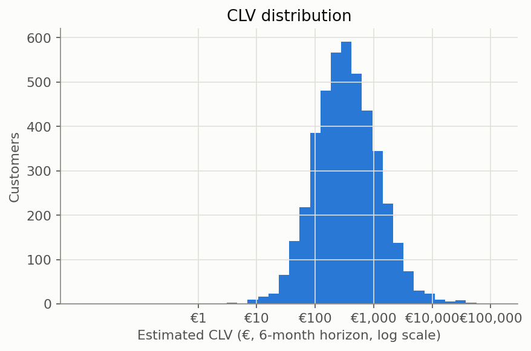

# Customer Lifetime Value and Retention Priority Report

Generated by `scripts/run_clv_and_retention_priority.py`. All numbers are measured from the actual transaction data and the Step 10 final model — none are estimated or assumed. This step scores the FULL eligible customer base (train + test combined), unlike Steps 7-11 which strictly evaluate on held-out test data — a retention program has to act on every customer, not just the ones used to evaluate the model.

## Methodology: why BG/NBD + Gamma-Gamma, not a simpler proxy

Online Retail II has exactly what this probabilistic approach needs: a genuine repeat-purchase transaction history per customer (not a single snapshot), in a non-contractual retail setting — the textbook BG/NBD use case. That prerequisite is checked, not assumed:

- **4,944 customers** have a usable transaction history to the cutoff.
- **3,336 (67.5%) are repeat customers** (frequency > 0) — enough to fit Gamma-Gamma's monetary-value model.
- **1,608 (32.5%) are one-time buyers** — handled with an explicit, transparent fallback (below), not silently dropped or forced through an unstable formula.

### Gamma-Gamma's independence assumption — checked

Gamma-Gamma assumes purchase frequency is independent of monetary value. Measured correlation among repeat customers: **0.0842** — negligible, so the assumption holds well for this population.

### A real limitation, found by testing this module while building it

Gamma-Gamma's conditional expectation formula is unstable at `frequency=0`: testing it directly on this data returned a **negative** "expected profit" for one-time buyers — not a theoretical footnote, an actual result reproduced while building this pipeline. This is exactly why the standard practice (followed here) fits Gamma-Gamma on repeat customers only. One-time buyers instead use their own single observed transaction value as the value estimate — the one real data point available for them.

## Fitted model parameters

**BG/NBD** (purchase frequency + "still alive" probability):

| parameter | value |
| --- | --- |
| r | 0.6858 |
| alpha | 66.3066 |
| a | 0.0835 |
| b | 1.2642 |

**Gamma-Gamma** (monetary value per transaction, repeat customers only):

| parameter | value |
| --- | --- |
| p | 11.8126 |
| q | 0.8764 |
| v | 11.7485 |

CLV is projected over a **6-month horizon**, matching the churn model's 183-day label window so the two scores are directly comparable. No discount rate is applied — a simplification stated explicitly rather than introducing another unverifiable assumption.

## CLV distribution

Median CLV: €329.72 | Mean: €875.53 (right-skewed, consistent with the monetary skew found throughout Steps 4-6).



## Retention Priority Score

```
retention_priority_score = churn_probability * CLV
```

Deliberately the simplest defensible formula: the expected revenue lost if a customer churns and nothing is done — the same expected-value logic as Step 10's business-cost framework, applied per customer.

## Why churn probability alone is not enough — measured, not asserted

Ranking the top **200** customers by churn probability alone vs. by the combined retention priority score, for the SAME contact-list size:

| Ranking strategy | Avg. CLV per customer | Total CLV-at-risk captured |
| --- | --- | --- |
| Churn probability alone | €40.35 | €7,171.60 |
| Retention priority score | €5,052.18 | €118,980.21 |

The two lists overlap by only **0.0%** — ranking on churn probability alone would spend the same retention budget on a substantially different, lower-value set of customers. This is the concrete, measured reason churn probability alone is not sufficient for a retention decision.

**Why the lists diverge so completely**: 76 customers share the exact same highest predicted churn probability — a plateau from the isotonic calibration Step 10 already documented as a small-sample artifact at the extreme end of the probability range. Every one of them is a long-dormant, zero-repeat-purchase customer with a small CLV (€50-60) — the model is confident they've already left, and there is little value left to protect even if they could be reached. The top-priority customer instead is **12346** — only 37.4% predicted churn probability, but an estimated CLV of €32,668.27 (a high-frequency, high-return-rate account — recognisable from Step 4's data-quality profiling). Moderate risk on a very large amount of value at stake outranks near-certain risk on very little.


## Segments

| segment | n_customers | avg_churn_probability | avg_clv | total_clv_at_risk |
| --- | --- | --- | --- | --- |
| Low risk / High value | 1888 | 0.19 | 1748.2 | 306336.13 |
| High risk / Low value | 1898 | 0.65 | 144.94 | 166814.8 |
| High risk / High value | 274 | 0.53 | 524.93 | 76156.1 |
| Low risk / Low value | 263 | 0.38 | 248.53 | 24806.57 |


- **High risk / High value** — the actual retention priority: likely to churn AND worth saving. Smallest budget, highest return per contact.
- **High risk / Low value** — likely to churn but little value at stake; a low-cost or automated touch at most (Step 10's cheap scenario), not a premium intervention.
- **Low risk / High value** — valuable and currently stable; monitor, don't spend retention budget here.
- **Low risk / Low value** — lowest priority by any measure.

## Top 10 customers by retention priority score

| customer_id | churn_probability | clv | retention_priority_score | segment |
| --- | --- | --- | --- | --- |
| 12346 | 0.374 | 32668.27 | 12205.12 | Low risk / High value |
| 15749 | 0.221 | 27296.87 | 6037.76 | Low risk / High value |
| 13687 | 0.574 | 4518.47 | 2595.0 | High risk / High value |
| 12590 | 0.221 | 11651.74 | 2577.23 | Low risk / High value |
| 12357 | 0.487 | 5039.2 | 2454.75 | High risk / High value |
| 18102 | 0.016 | 129170.62 | 2009.27 | Low risk / High value |
| 18251 | 0.412 | 3879.02 | 1596.26 | Low risk / High value |
| 12454 | 0.414 | 3406.01 | 1409.5 | Low risk / High value |
| 12939 | 0.18 | 6362.63 | 1144.7 | Low risk / High value |
| 14646 | 0.011 | 104878.26 | 1131.98 | Low risk / High value |

Full ranked list for all 4,323 customers: `reports/retention_priority_list.csv`.

## A limitation of the pure product formula, visible in the table above

**8 of the top 10 by priority score are "Low risk / High value," not "High risk / High value."** This is mathematically correct under `churn_probability * CLV` — CLV's range spans nearly five orders of magnitude (€0.01 to over €129,000), so even a very low churn probability on an extreme-value customer can outrank a genuinely at-risk customer with modest value. It is also a real practical limitation: a customer with a 1.6% churn probability is already essentially certain to stay, and no retention offer is likely to change an outcome that was never in doubt — ranking them highly overstates how actionable they are.

A deployment that wants to avoid this would filter to a minimum meaningful churn probability first (e.g. Step 10's cost-optimal threshold, or a stricter one chosen for capacity reasons) and rank by priority score only within that filtered set — combining "is this customer actually at risk" with "is it worth acting on them" instead of letting the second dominate the first. This report presents the unfiltered ranking so the trade-off stays visible rather than being hidden inside a second, unstated design choice.

The segment summary's `total_clv_at_risk` for "Low risk / High value" being the largest of all four segments is not a contradiction of "don't spend retention budget here" above — that column is a PORTFOLIO-level statistic (aggregate expected exposure summed across 1,888 customers), while the per-customer priority ranking is what should drive individual contact decisions. A segment can hold the most aggregate value at stake while still being the wrong place to spend a targeted retention budget.
