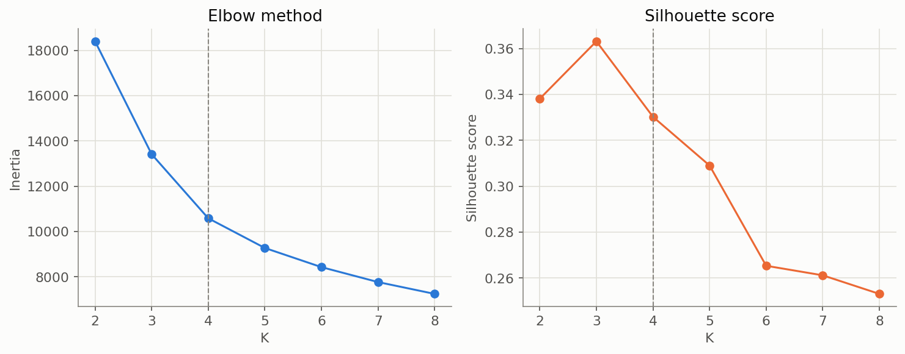

# Customer Segmentation Report

Generated by `scripts/run_customer_segmentation.py`. All numbers are measured on the same 4,323-customer population scored in Step 12 — none are estimated or assumed.

## Features and preprocessing

`recency_days, frequency, monetary_total, tenure_days, distinct_products, spend_ratio_90d, clv` — RFM core, tenure, catalogue breadth (the closest "service usage" proxy this dataset supports), a 90-day engagement/trend signal, and Step 12's CLV estimate. All complete for the full population (verified before building this module — no imputation needed). Yeo-Johnson power transform + standardisation before clustering: K-Means uses Euclidean distance, so the same skew that distorted Step 7's linear model would distort distance-based clustering too if left untransformed.

`rfm_score` and its component scores (Step 6) are deliberately excluded — they are discretised versions of `recency_days`/`frequency`/`monetary_total`, already in this list; including both would double-count the same signal in a distance metric.

## Choosing K — measured, not convenient

| k | inertia | silhouette |
| --- | --- | --- |
| 2 | 18398.4582 | 0.3381 |
| 3 | 13414.0828 | 0.3632 |
| 4 | 10587.0998 | 0.3303 |
| 5 | 9276.1469 | 0.309 |
| 6 | 8430.9024 | 0.2654 |
| 7 | 7771.2374 | 0.2612 |
| 8 | 7249.3399 | 0.2531 |

Silhouette peaks at **K=3** (0.3632). This project uses **K=4** instead (0.3303 silhouette, only modestly lower) — a deliberate, stated trade-off: at K=3, the customers who have gone quiet form a single "at-risk" cluster; at K=4 that cluster splits into a **moderate-value, still-somewhat-engaged** group and a **near-total-loss, one-time-buyer** group with a 23-point churn-rate gap between them (measured below) — a genuinely different retention response for each, not a marginal or spurious split. Choosing K purely by maximum silhouette would have hidden that distinction.

## Stability and cross-method agreement

- **Split-half stability** (K-Means fit on two independent random halves, cross-predicted): ARI = **0.9566** — a partition this consistent across resamples is not an artefact of one particular fit.
- **K-Means vs. Hierarchical (Ward linkage)** at the same K: ARI = **0.7289** — moderate-to-strong agreement between two different algorithms is evidence the structure is real, not a K-Means-specific quirk.

## Cluster profiles (median values, business names assigned from these numbers)

| cluster | n_customers | recency_days | frequency | monetary_total | tenure_days | distinct_products | spend_ratio_90d | clv | churn_rate | churn_probability |
| --- | --- | --- | --- | --- | --- | --- | --- | --- | --- | --- |
| 0 — Declining / Moderate value | 1173 | 198.0 | 4.0 | 1153.85 | 459.0 | 59.0 | 0.0 | 310.27 | 0.475 | 0.465 |
| 1 — Champions (loyal, high value) | 1208 | 25.0 | 9.0 | 3523.165 | 499.0 | 126.0 | 0.155 | 1138.805 | 0.114 | 0.113 |
| 2 — New / Developing | 786 | 32.0 | 2.0 | 532.655 | 103.5 | 27.0 | 0.722 | 322.065 | 0.417 | 0.416 |
| 3 — Lost / One-time buyers | 1156 | 223.0 | 1.0 | 295.465 | 240.0 | 17.0 | 0.0 | 104.795 | 0.705 | 0.713 |

- **Champions (loyal, high value)** — lowest recency, highest frequency and monetary value, longest tenure, widest catalogue breadth, lowest churn rate by a wide margin.
- **Declining / Moderate value** — recency climbing, moderate historical value, churn meaningfully elevated but not extreme — still reachable.
- **Lost / One-time buyers** — longest recency, frequency at or near 1, lowest monetary value, highest churn rate of any cluster — the customers a retention program is least likely to be able to influence.
- **New / Developing** — short tenure, high `spend_ratio_90d` (most of their history is recent, because most of their history IS recent) — too early to tell whether they become Champions or Lost.

## Churn rate and value by cluster

## Does segmentation add value beyond the supervised churn model?

Cross-tabulated against Step 12's risk/value quadrant (churn probability x CLV, each split at its own median): agreement is **ARI = 0.3198**.

| segment_name | High risk / High value | High risk / Low value | Low risk / High value | Low risk / Low value |
| --- | --- | --- | --- | --- |
| Champions (loyal, high value) | 0 | 1 | 1162 | 45 |
| Declining / Moderate value | 173 | 520 | 374 | 106 |
| Lost / One-time buyers | 66 | 1087 | 0 | 3 |
| New / Developing | 35 | 290 | 352 | 109 |

A low-to-moderate agreement score: the clusters are NOT simply re-deriving Step 12's risk/value quadrant — segmentation is surfacing structure (e.g. the tenure/engagement distinctions between New and Declining customers) that the two-dimensional risk/value view collapses away. This is genuine added value, not just a restatement of the supervised model's output.

Full segmented list for all 4,323 customers: `reports/customer_segments.csv`.
