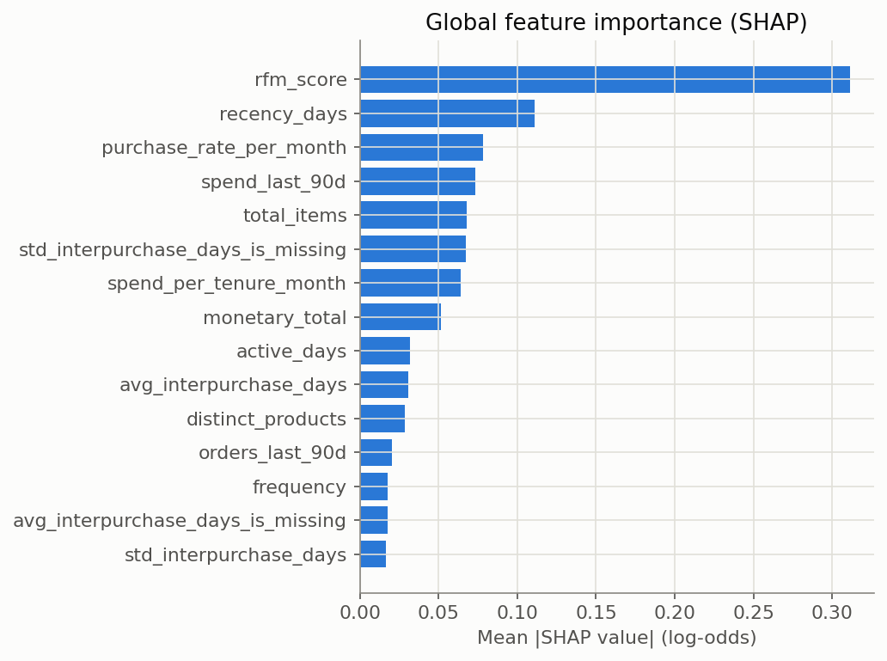
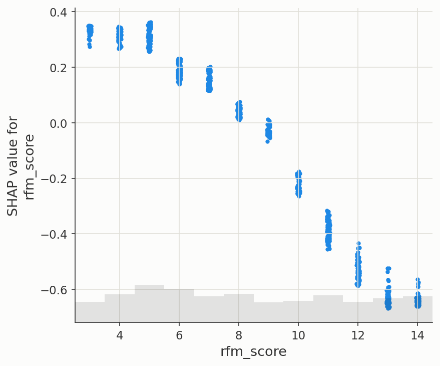
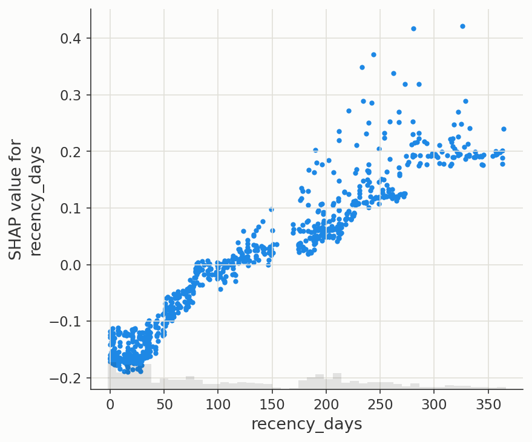
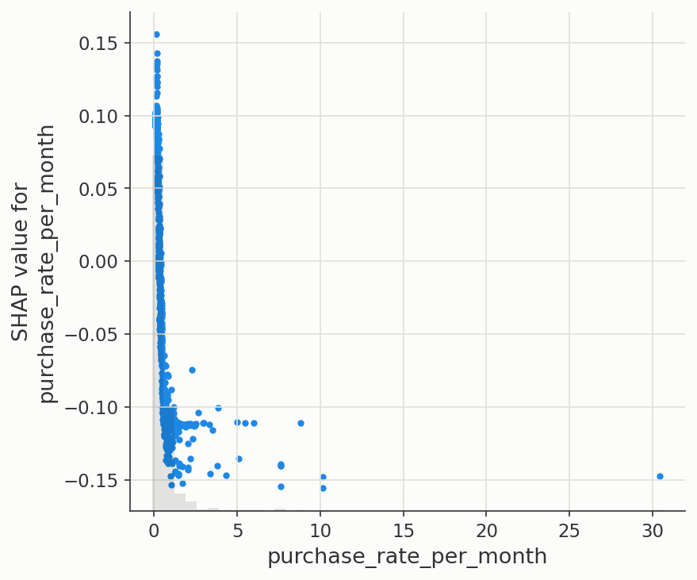
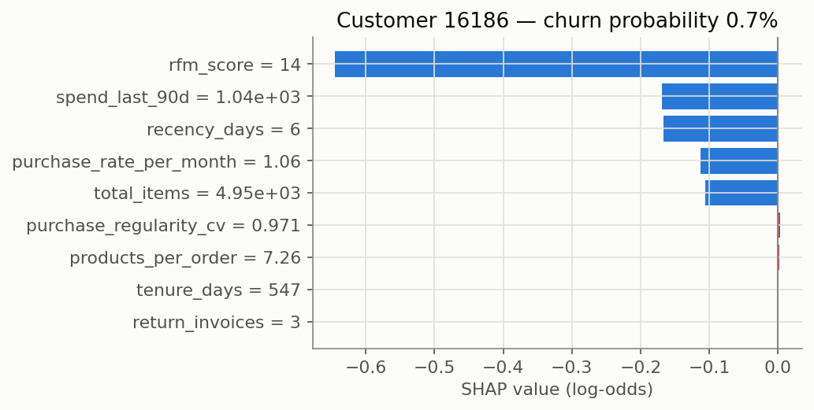
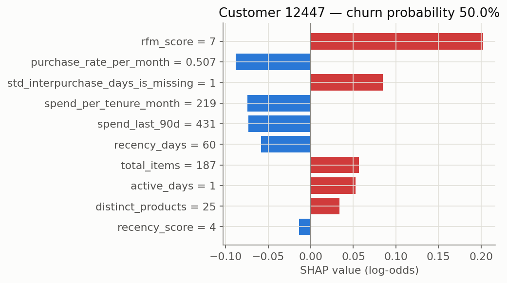

# SHAP Explainability Report

Generated by `scripts/run_shap_explainability.py`. All numbers are computed on the actual held-out test split — none are estimated or assumed.

## Methodology: which model SHAP explains, and why

The project's final model (`models/final_churn_model.joblib`, Step 10) is a `CalibratedClassifierCV` — internally 5 cloned pipelines, one per calibration fold. SHAP's `TreeExplainer` needs a single tree ensemble to walk, not a calibration wrapper around several, so it cannot be applied to that object directly.

- **SHAP attribution** (which features drive the decision) is computed on the pre-calibration Step 9 tuned XGBoost pipeline. Calibration rescales the final probability for reliability; it does not change which features the underlying trees split on.
- **The displayed probability** for every customer below comes from the calibrated final model, so it matches what the Step 10 business threshold and the Step 14 API will show.

## What SHAP values mean — and do not mean

A SHAP value is a feature's contribution to THIS model's THIS prediction, relative to the average prediction — a precise accounting number, not a statement about the real world.

- Values are in **log-odds (margin) space** (`TreeExplainer`'s default): positive pushes the model's score toward churn, negative pushes toward retention. The magnitude is not directly "N percentage points of probability."
- **A high-impact feature is not a cause of churn.** SHAP explains the model, not the customer's real decision — it cannot separate a genuine driver from a feature that merely correlates with one. `recency_days` (below) is a case in point: it is mechanically close to how churn is *labelled* (Step 3/5/9 all discuss this), which is exactly why it dominates — that is expected, not evidence of a causal effect. Causal claims need the experimental design in Step 20, not an explainability method applied to an observational model.

## Global feature importance

| feature | mean_abs_shap |
| --- | --- |
| rfm_score | 0.3111 |
| recency_days | 0.1112 |
| purchase_rate_per_month | 0.0781 |
| spend_last_90d | 0.0736 |
| total_items | 0.0679 |
| std_interpurchase_days_is_missing | 0.0673 |
| spend_per_tenure_month | 0.0643 |
| monetary_total | 0.0514 |
| active_days | 0.0317 |
| avg_interpurchase_days | 0.0309 |
| distinct_products | 0.0286 |
| orders_last_90d | 0.0203 |
| frequency | 0.0179 |
| avg_interpurchase_days_is_missing | 0.0175 |
| std_interpurchase_days | 0.0168 |




### Dependence: `rfm_score`



### Dependence: `recency_days`



### Dependence: `purchase_rate_per_month`



**`rfm_score` dominates by a wide margin** (mean |SHAP| 0.3111, nearly 3x the runner-up `recency_days` at 0.1112) — and the dependence plot above shows an almost perfectly monotonic relationship, exactly matching the clean gradient Step 6 found (79.6% churn at score 3 down to 2.8% at score 14).

**This is a striking contrast with Step 7's Logistic Regression**, where `rfm_score` had the single strongest UNIVARIATE correlation with churn of any feature, yet its multivariate coefficient nearly vanished and flipped sign — absorbed by its own raw ingredients (`recency_days`, `frequency`, `monetary_total`) still present in the linear model. XGBoost's trees don't have that problem: gradient boosting can freely choose to split on the clean, low-cardinality `rfm_score` (values 3-14) instead of its noisier continuous components whenever that split is more useful, without being penalised for correlated inputs the way a linear coefficient estimate is. The same feature is nearly worthless to one model family and the single most important input to another — a concrete illustration of why Step 8 measured multiple model families rather than trusting one's feature ranking.

## Local explanations — three representative customers

Red bars push the prediction toward churn, blue bars push toward retention — the same colour convention as every churn-outcome chart since Step 5.

### Highest predicted risk: customer 14822

**Customer 14822: 94.9% predicted churn probability (High risk). Top factors increasing risk: rfm_score = 3 (+0.35); recency_days = 302 (+0.19); monetary_total = 158 (+0.14); spend_per_tenure_month = 15.9 (+0.10); purchase_rate_per_month = 0.101 (+0.10). Top factors reducing risk: std_interpurchase_days = 40.2 (-0.00); avg_unit_price = 1.68 (-0.00); tenure_days = 302 (-0.00); return_rate_raw = 0 (-0.00); return_invoices = 0 (-0.00).**


### Lowest predicted risk: customer 16186

**Customer 16186: 0.7% predicted churn probability (Low risk). Top factors increasing risk: purchase_regularity_cv = 0.971 (+0.00); products_per_order = 7.26 (+0.00); tenure_days = 547 (+0.00); return_invoices = 3 (+0.00). Top factors reducing risk: rfm_score = 14 (-0.65); spend_last_90d = 1.04e+03 (-0.17); recency_days = 6 (-0.17); purchase_rate_per_month = 1.06 (-0.11); total_items = 4.95e+03 (-0.11).**



### Borderline (~50%): customer 12447

**Customer 12447: 50.0% predicted churn probability (Medium risk). Top factors increasing risk: rfm_score = 7 (+0.20); std_interpurchase_days_is_missing = 1 (+0.08); total_items = 187 (+0.06); active_days = 1 (+0.05); distinct_products = 25 (+0.03). Top factors reducing risk: purchase_rate_per_month = 0.507 (-0.09); spend_per_tenure_month = 219 (-0.07); spend_last_90d = 431 (-0.07); recency_days = 60 (-0.06); recency_score = 4 (-0.01).**



## Using `explain_customer()` elsewhere

```python
from src.explainability import explain_customer

result = explain_customer(customer_id, test_df, tuned_pipeline, final_model)
print(result['narrative'])
```

This same function is what Step 14's `/predict/explain` API endpoint calls — the explanation logic is written once here, not reimplemented in the API layer.
